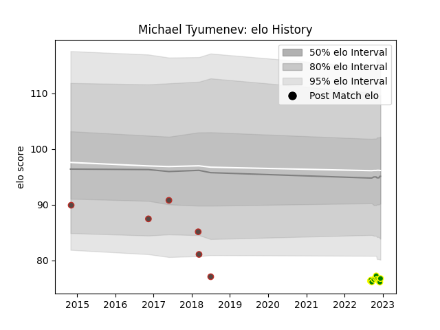

---  
layout: page  
title: Michael Tyumenev  
date: 2022-12-14 11:17:34.718720  
categories: player  
---
# Michael Tyumenev

## Positions: H

## Country: Germany

## Current elo: 77.0

## Current Percentile: 2.0

# Elo History

# Match History

| Team                |   Appearances |   Win Rate |
|:--------------------|--------------:|-----------:|
| Carqueiranne-Hyères |            11 |   0.363636 |
| Germany             |             6 |   0.333333 |

| Opponent                   |   Matches |   Win Rate |
|:---------------------------|----------:|-----------:|
| Albi                       |         1 |          1 |
| Narbonne                   |         1 |          0 |
| Tarbes                     |         1 |          1 |
| Suresnes                   |         1 |          0 |
| Spain                      |         1 |          0 |
| Samoa                      |         1 |          0 |
| Rennes                     |         1 |          0 |
| Nice                       |         1 |          0 |
| Namibia                    |         1 |          0 |
| Belgium                    |         1 |          0 |
| Kenya                      |         1 |          1 |
| Dax                        |         1 |          0 |
| Cognac Saint Jean d'Angély |         1 |          1 |
| Chambery                   |         1 |          1 |
| Bourgoin-Jallieu           |         1 |          0 |
| Blagnac                    |         1 |          0 |
| Uruguay                    |         1 |          1 |