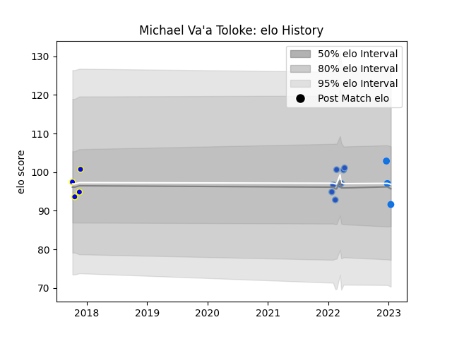

---  
layout: page  
title: Michael Va'a Toloke  
date: 2023-03-21 18:34:02.187043  
categories: player  
---
# Michael Va'a Toloke

Last updated: 2023-03-21
## Positions: C, W

## Current elo: 74.0

## Current Percentile: 5.0

# Elo History

# Match History

| Team                 |   Appearances |   Win Rate |
|:---------------------|--------------:|-----------:|
| Munakata Sanix Blues |             8 |      0.875 |
| Shimizu Blue Sharks  |             5 |      0.2   |
| Kamaishi Seawaves    |             4 |      0.625 |
| Urayasu D-Rocks      |             1 |      0     |

| Opponent                          |   Matches |   Win Rate |
|:----------------------------------|----------:|-----------:|
| Chugoku Red Regulions             |         3 |        1   |
| Kamaishi Seawaves                 |         2 |        0.5 |
| Kurita Water Gush                 |         2 |        1   |
| Kyuden Voltex                     |         2 |        1   |
| Shimizu Blue Sharks               |         2 |        0.5 |
| Urayasu D-Rocks                   |         2 |        0   |
| Chubu Electric Power              |         1 |        1   |
| Hino Red Dolphins                 |         1 |        0   |
| Kubota Spears Funabashi Tokyo-Bay |         1 |        0   |
| Mazda Blue Zoomers                |         1 |        0.5 |
| Mie Honda Heat                    |         1 |        0   |