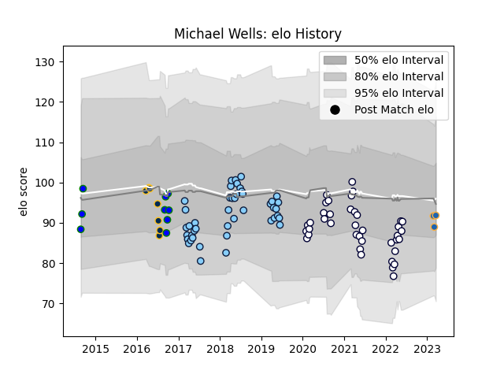

---  
layout: page  
title: Michael Wells  
date: 2023-03-02 11:27:40.013149  
categories: player  
---
# Michael Wells

## Positions: N8, FL

## Current elo: 92.0

## Current Percentile: 35.0

# Elo History

# Match History

| Team                     |   Appearances |   Win Rate |
|:-------------------------|--------------:|-----------:|
| New South Wales Waratahs |            44 |   0.420455 |
| Melbourne Rebels         |            39 |   0.346154 |
| North Harbour Rays       |             9 |   0.666667 |
| Brumbies                 |             7 |   0.428571 |
| Western Force            |             1 |   1        |

| Opponent                 |   Matches |   Win Rate |
|:-------------------------|----------:|-----------:|
| Queensland Reds          |        11 |   0.5      |
| Western Force            |         9 |   0.666667 |
| Brumbies                 |         9 |   0.111111 |
| Highlanders              |         8 |   0.5      |
| New South Wales Waratahs |         7 |   0.714286 |
| Melbourne Rebels         |         7 |   1        |
| Crusaders                |         6 |   0.166667 |
| Lions                    |         5 |   0.2      |
| Blues                    |         5 |   0        |
| Chiefs                   |         4 |   0        |
| Sharks                   |         4 |   0.125    |
| Sunwolves                |         4 |   0.5      |
| Jaguares                 |         3 |   0        |
| Hurricanes               |         3 |   0        |
| Fijian Drua              |         2 |   0.5      |
| NSW Country Eagles       |         2 |   0        |
| Queensland Country       |         2 |   1        |
| Stormers                 |         2 |   0.5      |
| Melbourne Rising         |         2 |   0.5      |
| Brisbane City            |         1 |   1        |
| Moana Pasifika           |         1 |   1        |
| Perth Spirit             |         1 |   1        |
| Canberra Vikings         |         1 |   1        |
| Southern Kings           |         1 |   0        |