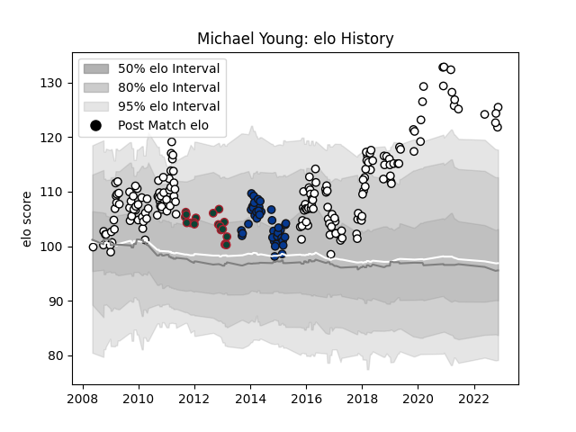

---  
layout: page  
title: Michael Young  
date: 2022-12-12 15:29:01.573415  
categories: player  
---
# Michael Young

## Positions: SH

## Current elo: 122.0

## Current Percentile: 97.0

# Elo History

# Match History

| Team              |   Appearances |   Win Rate |
|:------------------|--------------:|-----------:|
| Newcastle Falcons |           172 |   0.412791 |
| Bath Rugby        |            39 |   0.653846 |
| Leicester Tigers  |            20 |   0.65     |

| Opponent            |   Matches |   Win Rate |
|:--------------------|----------:|-----------:|
| Harlequins          |        20 |   0.425    |
| Gloucester Rugby    |        20 |   0.5      |
| Wasps               |        17 |   0.352941 |
| Bath Rugby          |        16 |   0.375    |
| Saracens            |        16 |   0.125    |
| Sale Sharks         |        15 |   0.566667 |
| Exeter Chiefs       |        15 |   0.333333 |
| Leicester Tigers    |        14 |   0.285714 |
| Northampton Saints  |        13 |   0.346154 |
| London Irish        |        12 |   0.541667 |
| Worcester Warriors  |         9 |   0.5      |
| Newcastle Falcons   |         5 |   1        |
| Bristol Rugby       |         5 |   0.4      |
| Leeds               |         4 |   0.375    |
| London Welsh        |         4 |   1        |
| Montpellier Herault |         4 |   0.5      |
| Yorkshire Carnegie  |         4 |   0.375    |
| Dragons             |         4 |   0.75     |
| Brive               |         4 |   0.5      |
| RC Enisei           |         3 |   1        |
| Ospreys             |         3 |   0.333333 |
| Toulon              |         2 |   0.5      |
| Aironi              |         2 |   1        |
| Cardiff Blues       |         2 |   1        |
| Bordeaux Begles     |         2 |   1        |
| Bedford             |         2 |   1        |
| Jersey              |         2 |   1        |
| Leinster            |         1 |   0        |
| Ampthill            |         1 |   1        |
| Mogliano            |         1 |   1        |
| Montauban           |         1 |   1        |
| Hartpury College    |         1 |   1        |
| Grenoble            |         1 |   0        |
| Glasgow Warriors    |         1 |   0        |
| Coventry            |         1 |   1        |
| Connacht            |         1 |   1        |
| Bourgoin-Jallieu    |         1 |   1        |
| Scarlets            |         1 |   0        |
| Benetton Treviso    |         1 |   1        |