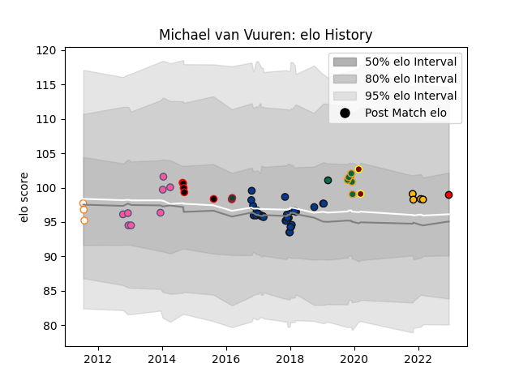

---  
layout: page  
title: Michael van Vuuren  
date: 2022-12-18 16:31:04.219419  
categories: player  
---
# Michael van Vuuren

## Positions: H

## Current elo: 99.0

## Current Percentile: None

# Elo History

# Match History

| Team                   |   Appearances |   Win Rate |
|:-----------------------|--------------:|-----------:|
| Bath Rugby             |            29 |   0.5      |
| Stade Francais Paris   |             8 |   0.75     |
| Northampton Saints     |             6 |   0.666667 |
| Eastern Province Kings |             5 |   0        |
| Wasps                  |             4 |   0.5      |
| Free State Cheetahs    |             3 |   0.333333 |
| Ampthill               |             2 |   0.5      |
| Leicester Tigers       |             2 |   0.5      |
| Lions                  |             1 |   1        |
| London Irish           |             1 |   1        |

| Opponent             |   Matches |   Win Rate |
|:---------------------|----------:|-----------:|
| Harlequins           |         4 |   0.5      |
| Wasps                |         4 |   0.25     |
| Exeter Chiefs        |         3 |   0.333333 |
| London Irish         |         3 |   1        |
| Leicester Tigers     |         3 |   0.666667 |
| Saracens             |         3 |   0.666667 |
| Cavalieri Prato      |         3 |   1        |
| Bristol Rugby        |         3 |   0.333333 |
| Blue Bulls           |         3 |   0        |
| Golden Lions         |         2 |   0        |
| Cardiff Blues        |         2 |   0.5      |
| Sale Sharks          |         2 |   0.5      |
| Leinster             |         2 |   0        |
| Toulon               |         2 |   0.5      |
| Benetton Treviso     |         2 |   1        |
| Scarlets             |         2 |   0        |
| Newcastle Falcons    |         2 |   0.5      |
| Worcester Warriors   |         1 |   1        |
| Western Province     |         1 |   0        |
| Stade Toulousain     |         1 |   0        |
| Stade Francais Paris |         1 |   1        |
| Bath Rugby           |         1 |   1        |
| London Scottish      |         1 |   1        |
| Pau                  |         1 |   1        |
| Northampton Saints   |         1 |   1        |
| Natal Sharks         |         1 |   0        |
| Lusitanos XV         |         1 |   1        |
| London Welsh         |         1 |   1        |
| Leopards             |         1 |   1        |
| Grenoble             |         1 |   0        |
| Gloucester Rugby     |         1 |   0.5      |
| Cornish Pirates      |         1 |   0        |
| Yorkshire Carnegie   |         1 |   1        |