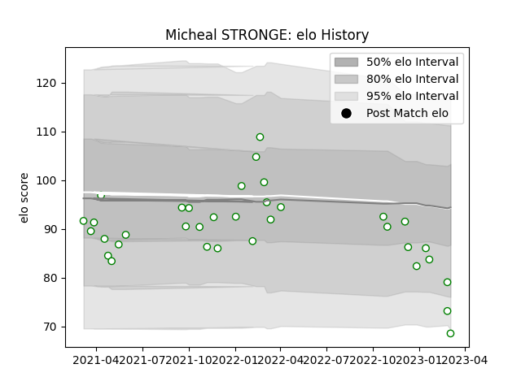

---  
layout: page  
title: Micheal STRONGE  
date: 2023-01-17 11:39:24.348381  
categories: player  
---
# Micheal STRONGE

## Positions: SH

## Current elo: 88.0

## Current Percentile: 18.0

# Elo History

# Match History

| Team       |   Appearances |   Win Rate |
|:-----------|--------------:|-----------:|
| Nottingham |            31 |   0.225806 |

| Opponent            |   Matches |   Win Rate |
|:--------------------|----------:|-----------:|
| Coventry            |         4 |   0.25     |
| Jersey              |         4 |   0        |
| Richmond            |         4 |   0.5      |
| Bedford             |         3 |   0        |
| Cornish Pirates     |         3 |   0        |
| Ealing Trailfinders |         3 |   0        |
| Hartpury College    |         3 |   0.333333 |
| Ampthill            |         2 |   0.5      |
| Doncaster           |         2 |   0        |
| London Scottish     |         2 |   1        |
| Saracens            |         1 |   0        |