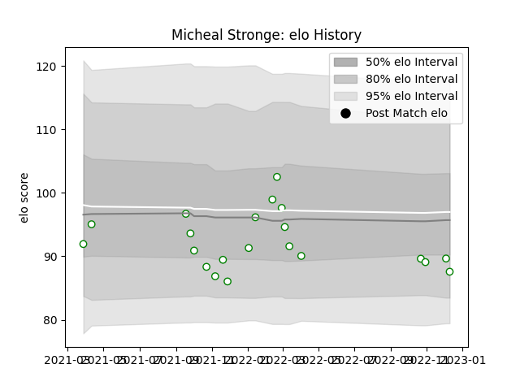

---  
layout: page  
title: Micheal Stronge  
date: 2022-12-14 11:16:01.981669  
categories: player  
---
# Micheal Stronge

## Positions: SH

## Current elo: 88.0

## Current Percentile: 25.0

# Elo History

# Match History

| Team       |   Appearances |   Win Rate |
|:-----------|--------------:|-----------:|
| Nottingham |            21 |   0.285714 |

| Opponent            |   Matches |   Win Rate |
|:--------------------|----------:|-----------:|
| Bedford             |         3 |   0        |
| Coventry            |         3 |   0.333333 |
| Hartpury College    |         3 |   0.333333 |
| Richmond            |         3 |   0.333333 |
| Ealing Trailfinders |         2 |   0        |
| Jersey              |         2 |   0        |
| London Scottish     |         2 |   1        |
| Ampthill            |         1 |   1        |
| Cornish Pirates     |         1 |   0        |
| Doncaster           |         1 |   0        |