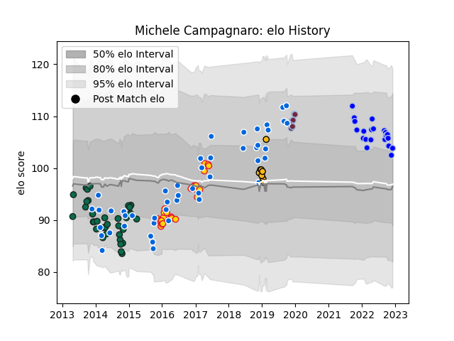

---  
layout: page  
title: Michele Campagnaro  
date: 2022-11-22 11:39:17.901578  
categories: player  
---
# Michele Campagnaro

## Positions: C

## Country: Italy

## Current elo: 102.0

## Current Percentile: 77.0

# Elo History

# Match History

| Team             |   Appearances |   Win Rate |
|:-----------------|--------------:|-----------:|
| Italy            |            47 |   0.212766 |
| Benetton Treviso |            35 |   0.257143 |
| Exeter Chiefs    |            28 |   0.660714 |
| Colomiers        |            20 |   0.5      |
| Wasps            |             8 |   0.25     |
| Harlequins       |             7 |   0.5      |

| Opponent                 |   Matches |   Win Rate |
|:-------------------------|----------:|-----------:|
| Ireland                  |         7 |   0        |
| Ulster                   |         6 |   0.166667 |
| Scotland                 |         5 |   0        |
| Ospreys                  |         5 |   0.4      |
| France                   |         5 |   0        |
| Clermont Auvergne        |         4 |   0.25     |
| Worcester Warriors       |         4 |   0.75     |
| England                  |         4 |   0        |
| Wasps                    |         4 |   0.75     |
| Saracens                 |         4 |   0.375    |
| Bordeaux Begles          |         4 |   0.5      |
| Dragons                  |         4 |   0.25     |
| Gloucester Rugby         |         3 |   0.666667 |
| Munster                  |         3 |   0.333333 |
| Japan                    |         3 |   0.333333 |
| Argentina                |         3 |   0        |
| Northampton Saints       |         3 |   0.333333 |
| Rouen                    |         3 |   0.666667 |
| Glasgow Warriors         |         3 |   0        |
| Scarlets                 |         3 |   0.333333 |
| Connacht                 |         3 |   0.5      |
| Cardiff Blues            |         3 |   0.5      |
| Bath Rugby               |         3 |   0.333333 |
| Canada                   |         3 |   1        |
| Wales                    |         3 |   0        |
| Georgia                  |         2 |   1        |
| Nevers                   |         2 |   0.5      |
| Sale Sharks              |         2 |   1        |
| Australia                |         2 |   0        |
| South Africa             |         2 |   0        |
| Racing 92                |         2 |   0        |
| Provence Rugby           |         2 |   0.5      |
| Bayonne                  |         2 |   0.5      |
| Bristol Rugby            |         2 |   1        |
| Fiji                     |         2 |   0        |
| Montpellier Herault      |         2 |   0        |
| Vannes                   |         2 |   0.5      |
| Leinster                 |         2 |   0        |
| Leicester Tigers         |         2 |   0.25     |
| Harlequins               |         2 |   0.5      |
| Zebre                    |         2 |   1        |
| Tonga                    |         1 |   0        |
| Stade Toulousain         |         1 |   0        |
| US Bressane              |         1 |   0        |
| United States of America |         1 |   1        |
| Agen                     |         1 |   1        |
| Samoa                    |         1 |   1        |
| Russia                   |         1 |   1        |
| Romania                  |         1 |   1        |
| New Zealand              |         1 |   0        |
| Narbonne                 |         1 |   1        |
| Montauban                |         1 |   0        |
| London Irish             |         1 |   1        |
| Edinburgh                |         1 |   1        |
| Carcassonne              |         1 |   0        |
| Biarritz Olympique       |         1 |   0        |
| Beziers                  |         1 |   1        |
| Aurillac                 |         1 |   0        |
| Mont-de-Marsan           |         1 |   1        |