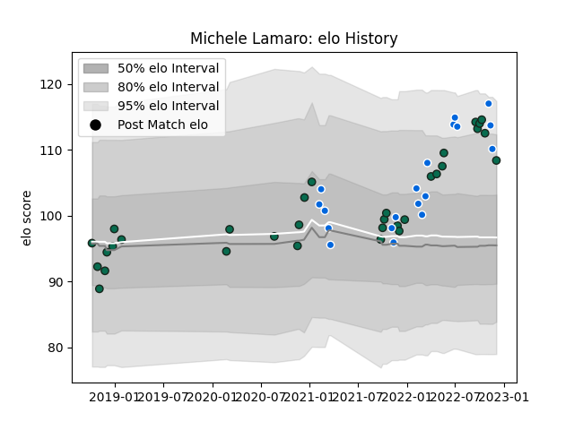

---  
layout: page  
title: Michele Lamaro  
date: 2022-12-09 13:11:15.186432  
categories: player  
---
# Michele Lamaro

## Positions: FL, N8

## Country: Italy

## Current elo: 108.0

## Current Percentile: 88.0

# Elo History

# Match History

| Team             |   Appearances |   Win Rate |
|:-----------------|--------------:|-----------:|
| Benetton Treviso |            32 |   0.484375 |
| Italy            |            19 |   0.315789 |

| Opponent             |   Matches |   Win Rate |
|:---------------------|----------:|-----------:|
| Zebre                |         6 |   0.666667 |
| Cardiff Blues        |         3 |   0.333333 |
| Ulster               |         3 |   0.166667 |
| France               |         2 |   0        |
| Ospreys              |         2 |   0        |
| Leinster             |         2 |   0        |
| Ireland              |         2 |   0        |
| Glasgow Warriors     |         2 |   1        |
| Scotland             |         2 |   0        |
| England              |         2 |   0        |
| Edinburgh            |         2 |   0.5      |
| Dragons              |         2 |   1        |
| Connacht             |         2 |   0        |
| Wales                |         2 |   0.5      |
| Bulls                |         2 |   0        |
| Southern Kings       |         2 |   1        |
| Stade Francais Paris |         1 |   1        |
| Uruguay              |         1 |   1        |
| Stormers             |         1 |   1        |
| South Africa         |         1 |   0        |
| Argentina            |         1 |   0        |
| Scarlets             |         1 |   1        |
| Samoa                |         1 |   1        |
| Romania              |         1 |   1        |
| Portugal             |         1 |   1        |
| Australia            |         1 |   1        |
| Georgia              |         1 |   0        |
| Cheetahs             |         1 |   0        |
| New Zealand          |         1 |   0        |