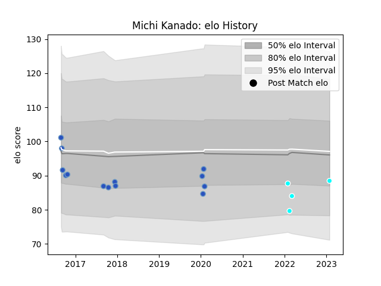

---  
layout: page  
title: Michi Kanado  
date: 2023-02-02 18:59:27.390601  
categories: player  
---
# Michi Kanado

## Positions: FL

## Current elo: 89.0

## Current Percentile: 18.0

# Elo History

# Match History

| Team                             |   Appearances |   Win Rate |
|:---------------------------------|--------------:|-----------:|
| Munakata Sanix Blues             |            13 |   0.384615 |
| Toyota Industries Shuttles Aichi |             4 |   1        |

| Opponent                          |   Matches |   Win Rate |
|:----------------------------------|----------:|-----------:|
| Black Rams Tokyo                  |         2 |          0 |
| Chugoku Red Regulions             |         2 |          1 |
| Shizuoka Blue Revs                |         2 |          0 |
| Green Rockets Tokatsu             |         1 |          1 |
| Hanazono Kintetsu Liners          |         1 |          1 |
| Kamaishi Seawaves                 |         1 |          1 |
| Kubota Spears Funabashi Tokyo-Bay |         1 |          0 |
| Kyuden Voltex                     |         1 |          1 |
| Mie Honda Heat                    |         1 |          1 |
| NTT Docomo Red Hurricanes Osaka   |         1 |          1 |
| Saitama Wild Knights              |         1 |          0 |
| Tokyo Sungoliath                  |         1 |          0 |
| Toyota Industries Shuttles Aichi  |         1 |          1 |
| Yokohama Canon Eagles             |         1 |          0 |