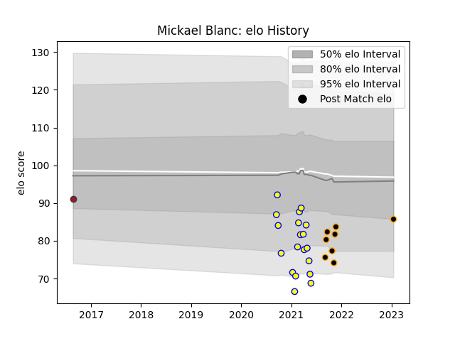

---  
layout: page  
title: Mickael Blanc  
date: 2023-03-17 17:39:31.153583  
categories: player  
---
# Mickael Blanc

## Positions: C

## Current elo: 74.0

## Current Percentile: 15.0

# Elo History

# Match History

| Team     |   Appearances |   Win Rate |
|:---------|--------------:|-----------:|
| Aubenas  |            19 |   0.236842 |
| Chambery |             7 |   0.857143 |
| Toulon   |             1 |   0        |

| Opponent                   |   Matches |   Win Rate |
|:---------------------------|----------:|-----------:|
| Suresnes                   |         3 |   0.666667 |
| Albi                       |         2 |   0        |
| Blagnac                    |         2 |   0.5      |
| Bourgoin-Jallieu           |         2 |   0.5      |
| Chambery                   |         2 |   0.5      |
| Dax                        |         2 |   0.5      |
| Dijon                      |         2 |   0.75     |
| Massy                      |         2 |   0        |
| Nice                       |         2 |   0        |
| Tarbes                     |         2 |   0.5      |
| Aubenas                    |         1 |   1        |
| Bayonne                    |         1 |   0        |
| Cognac Saint Jean d'Angély |         1 |   0        |
| Narbonne                   |         1 |   0        |
| Soyaux-Angouleme           |         1 |   1        |
| US Bressane                |         1 |   0        |