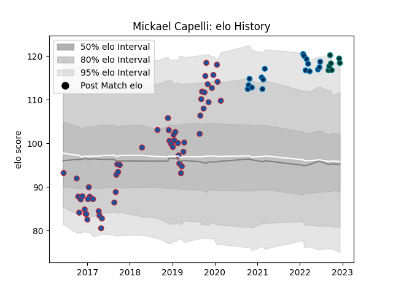

---  
layout: page  
title: Mickael Capelli  
date: 2023-01-06 00:24:44.761543  
categories: player  
---
# Mickael Capelli

## Positions: L

## Current elo: 127.0

## Current Percentile: 95.0

# Elo History

# Match History

| Team                |   Appearances |   Win Rate |
|:--------------------|--------------:|-----------:|
| Grenoble            |            60 |   0.45     |
| Montpellier Herault |            17 |   0.735294 |
| Pau                 |             8 |   0.25     |

| Opponent             |   Matches |   Win Rate |
|:---------------------|----------:|-----------:|
| Clermont Auvergne    |         6 |   0.166667 |
| Toulon               |         5 |   0.4      |
| Stade Toulousain     |         5 |   0.4      |
| Castres Olympique    |         4 |   0.25     |
| La Rochelle          |         4 |   0.25     |
| Stade Francais Paris |         4 |   0.75     |
| Racing 92            |         3 |   0        |
| Lyon                 |         3 |   0.333333 |
| Perpignan            |         3 |   0.333333 |
| Agen                 |         3 |   1        |
| Montauban            |         3 |   0.333333 |
| Soyaux-Angouleme     |         3 |   1        |
| Brive                |         3 |   0.5      |
| Beziers              |         3 |   1        |
| Bayonne              |         3 |   0.333333 |
| Montpellier Herault  |         3 |   0.333333 |
| Pau                  |         2 |   0.5      |
| Ospreys              |         2 |   0        |
| Newcastle Falcons    |         2 |   0.5      |
| Mont-de-Marsan       |         2 |   0.5      |
| Aurillac             |         2 |   1        |
| Bordeaux Begles      |         2 |   0.5      |
| Cheetahs             |         1 |   0        |
| Benetton Treviso     |         1 |   0        |
| Biarritz Olympique   |         1 |   1        |
| Carcassonne          |         1 |   1        |
| Roval Drome XV       |         1 |   1        |
| Rouen                |         1 |   1        |
| Provence Rugby       |         1 |   1        |
| Narbonne             |         1 |   1        |
| Colomiers            |         1 |   0        |
| Dax                  |         1 |   1        |
| Oyonnax              |         1 |   1        |
| Harlequins           |         1 |   0        |
| Massy                |         1 |   1        |
| Nevers               |         1 |   1        |
| Vannes               |         1 |   0        |