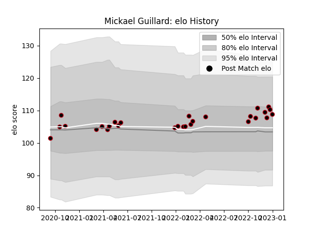

---  
layout: page  
title: Mickael Guillard  
date: 2022-12-09 13:10:13.806549  
categories: player  
---
# Mickael Guillard

## Positions: L, FL

## Current elo: 97.0

## Current Percentile: 62.0

# Elo History

# Match History

| Team   |   Appearances |   Win Rate |
|:-------|--------------:|-----------:|
| Lyon   |            23 |   0.608696 |

| Opponent             |   Matches |   Win Rate |
|:---------------------|----------:|-----------:|
| Bayonne              |         3 |   0.666667 |
| Clermont Auvergne    |         3 |   0.333333 |
| Brive                |         2 |   1        |
| Castres Olympique    |         2 |   0.5      |
| La Rochelle          |         2 |   0        |
| Perpignan            |         2 |   0.5      |
| Stade Francais Paris |         2 |   0.5      |
| Toulon               |         2 |   0.5      |
| Agen                 |         1 |   1        |
| Biarritz Olympique   |         1 |   1        |
| Bordeaux Begles      |         1 |   1        |
| Pau                  |         1 |   1        |
| Stade Toulousain     |         1 |   1        |