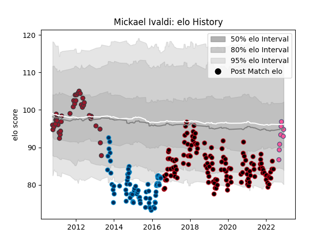

---  
layout: page  
title: Mickael Ivaldi  
date: 2023-02-02 19:04:16.899144  
categories: player  
---
# Mickael Ivaldi

## Positions: H

## Current elo: 81.0

## Current Percentile: 22.0

# Elo History

# Match History

| Team                 |   Appearances |   Win Rate |
|:---------------------|--------------:|-----------:|
| Lyon                 |           134 |   0.559701 |
| Montpellier Herault  |            83 |   0.536145 |
| Toulon               |            45 |   0.666667 |
| Stade Francais Paris |            12 |   0.75     |

| Opponent             |   Matches |   Win Rate |
|:---------------------|----------:|-----------:|
| Racing 92            |        20 |   0.575    |
| Toulon               |        20 |   0.45     |
| Castres Olympique    |        20 |   0.4      |
| Clermont Auvergne    |        19 |   0.447368 |
| Bordeaux Begles      |        18 |   0.611111 |
| Stade Toulousain     |        18 |   0.5      |
| Montpellier Herault  |        17 |   0.647059 |
| Brive                |        16 |   0.59375  |
| Stade Francais Paris |        16 |   0.6875   |
| Pau                  |        13 |   0.576923 |
| Bayonne              |        13 |   0.692308 |
| La Rochelle          |        12 |   0.541667 |
| Agen                 |        10 |   0.7      |
| Grenoble             |         9 |   0.777778 |
| Perpignan            |         8 |   0.75     |
| Oyonnax              |         6 |   0.666667 |
| Lyon                 |         5 |   0.8      |
| Biarritz Olympique   |         5 |   0.6      |
| Glasgow Warriors     |         3 |   0        |
| Cardiff Blues        |         3 |   0.666667 |
| Harlequins           |         2 |   0.5      |
| Leicester Tigers     |         2 |   0.5      |
| London Irish         |         2 |   1        |
| Benetton Treviso     |         2 |   1        |
| Newcastle Falcons    |         2 |   0.5      |
| Ospreys              |         2 |   0.5      |
| Sale Sharks          |         1 |   1        |
| Petrarca Padova      |         1 |   1        |
| Leinster             |         1 |   0        |
| Northampton Saints   |         1 |   0        |
| Munster              |         1 |   0        |
| Mont-de-Marsan       |         1 |   1        |
| Bath Rugby           |         1 |   0        |
| Dragons              |         1 |   1        |
| Calvisano            |         1 |   1        |
| Bourgoin-Jallieu     |         1 |   1        |
| Ulster               |         1 |   0        |