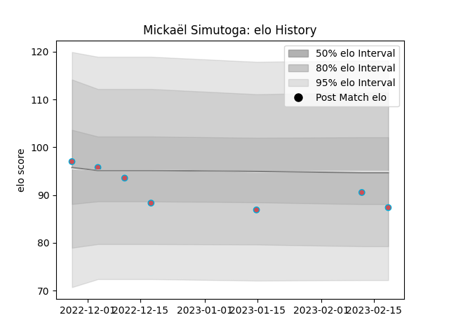

---  
layout: page  
title: Mickaël Simutoga  
date: 2023-02-24 02:29:35.804623  
categories: player  
---
# Mickaël Simutoga

## Positions: P

## Current elo: 87.0

## Current Percentile: 33.0

# Elo History

# Match History

| Team             |   Appearances |   Win Rate |
|:-----------------|--------------:|-----------:|
| Bourgoin-Jallieu |             7 |   0.714286 |

| Opponent                   |   Matches |   Win Rate |
|:---------------------------|----------:|-----------:|
| Albi                       |         1 |          1 |
| Blagnac                    |         1 |          0 |
| Carqueiranne-Hyères        |         1 |          1 |
| Cognac Saint Jean d'Angély |         1 |          1 |
| Narbonne                   |         1 |          0 |
| Rennes                     |         1 |          1 |
| Suresnes                   |         1 |          1 |