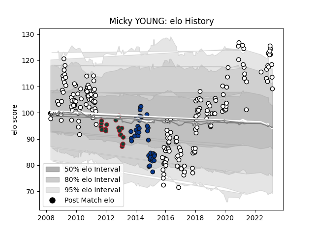

---  
layout: page  
title: Micky YOUNG  
date: 2023-03-30 11:34:27.785166  
categories: player  
---
# Micky YOUNG

Last updated: 2023-03-30
## Positions: SH

## Current elo: 103.0

## Current Percentile: 78.0

# Elo History

# Match History

| Team              |   Appearances |   Win Rate |
|:------------------|--------------:|-----------:|
| Newcastle Falcons |           193 |   0.430052 |
| Bath Rugby        |            39 |   0.653846 |
| Leicester Tigers  |            20 |   0.65     |

| Opponent               |   Matches |   Win Rate |
|:-----------------------|----------:|-----------:|
| Harlequins             |        20 |   0.425    |
| Gloucester Rugby       |        20 |   0.5      |
| Bath Rugby             |        17 |   0.352941 |
| Wasps                  |        17 |   0.352941 |
| Saracens               |        17 |   0.117647 |
| Leicester Tigers       |        16 |   0.3125   |
| Sale Sharks            |        16 |   0.53125  |
| Exeter Chiefs          |        16 |   0.3125   |
| London Irish           |        14 |   0.464286 |
| Northampton Saints     |        13 |   0.346154 |
| Worcester Warriors     |        10 |   0.55     |
| Bristol Rugby          |         6 |   0.333333 |
| Newcastle Falcons      |         5 |   1        |
| Yorkshire Carnegie     |         5 |   0.5      |
| Dragons                |         4 |   0.75     |
| Leeds                  |         4 |   0.375    |
| Montpellier Herault    |         4 |   0.5      |
| London Welsh           |         4 |   1        |
| Brive                  |         4 |   0.5      |
| Ospreys                |         4 |   0.5      |
| Enisey-STM Krasnoyarsk |         3 |   1        |
| RC Enisei              |         3 |   1        |
| Cardiff Blues          |         3 |   0.666667 |
| Toulon                 |         2 |   0.5      |
| Aironi                 |         2 |   1        |
| Jersey                 |         2 |   1        |
| Bedford                |         2 |   1        |
| Bordeaux Begles        |         2 |   1        |
| Connacht               |         2 |   1        |
| Coventry               |         1 |   1        |
| Benetton Treviso       |         1 |   1        |
| Scarlets               |         1 |   0        |
| Bourgoin-Jallieu       |         1 |   1        |
| Cornish Pirates        |         1 |   1        |
| Nottingham             |         1 |   1        |
| Leinster               |         1 |   0        |
| Doncaster              |         1 |   1        |
| Ealing Trailfinders    |         1 |   1        |
| Glasgow Warriors       |         1 |   0        |
| Montauban              |         1 |   1        |
| Mogliano               |         1 |   1        |
| Grenoble               |         1 |   0        |
| Ampthill               |         1 |   1        |
| Hartpury College       |         1 |   1        |