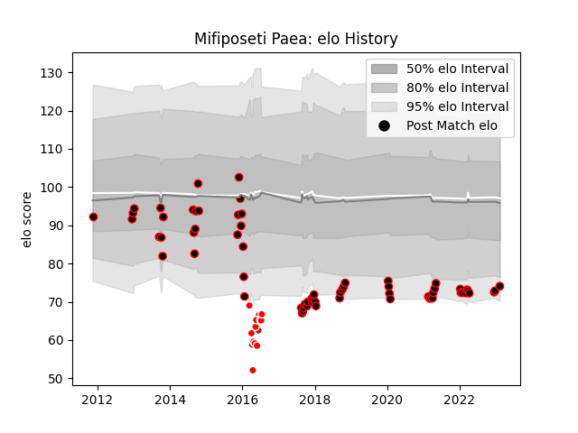

---  
layout: page  
title: Mifiposeti Paea  
date: 2022-12-28 12:53:34.343931  
categories: player  
---
# Mifiposeti Paea

## Positions: C, W

## Country: Japan

## Current elo: 88.0

## Current Percentile: 19.0

# Elo History

# Match History

| Team                            |   Appearances |   Win Rate |
|:--------------------------------|--------------:|-----------:|
| NTT Docomo Red Hurricanes Osaka |            42 |   0.345238 |
| Sunwolves                       |            14 |   0.107143 |
| Japan                           |             2 |   0.5      |

| Opponent                          |   Matches |   Win Rate |
|:----------------------------------|----------:|-----------:|
| Black Rams Tokyo                  |         5 |   0.2      |
| Kobelco Kobe Steelers             |         4 |   0.25     |
| Green Rockets Tokatsu             |         3 |   0.833333 |
| Toshiba Brave Lupus Tokyo         |         3 |   0        |
| Shizuoka Blue Revs                |         3 |   0        |
| Yokohama Canon Eagles             |         3 |   0.333333 |
| Coca-Cola Red Sparks              |         2 |   0.5      |
| Kyuden Voltex                     |         2 |   1        |
| Toyota Verblitz                   |         2 |   0        |
| Bulls                             |         2 |   0        |
| Tokyo Sungoliath                  |         2 |   0        |
| Stormers                          |         2 |   0.25     |
| Saitama Wild Knights              |         2 |   0        |
| Munakata Sanix Blues              |         2 |   0.5      |
| Mitsubishi Dynaboars              |         2 |   1        |
| Hanazono Kintetsu Liners          |         2 |   0        |
| Cheetahs                          |         2 |   0        |
| Melbourne Rebels                  |         1 |   0        |
| Southern Kings                    |         1 |   0        |
| Western Force                     |         1 |   0        |
| Toyota Industries Shuttles Aichi  |         1 |   0        |
| Jaguares                          |         1 |   1        |
| Kamaishi Seawaves                 |         1 |   1        |
| Canada                            |         1 |   1        |
| Brumbies                          |         1 |   0        |
| Sharks                            |         1 |   0        |
| Scotland                          |         1 |   0        |
| Kubota Spears Funabashi Tokyo-Bay |         1 |   0        |
| Chugoku Red Regulions             |         1 |   1        |
| New South Wales Waratahs          |         1 |   0        |
| Kurita Water Gush                 |         1 |   1        |
| Queensland Reds                   |         1 |   0        |