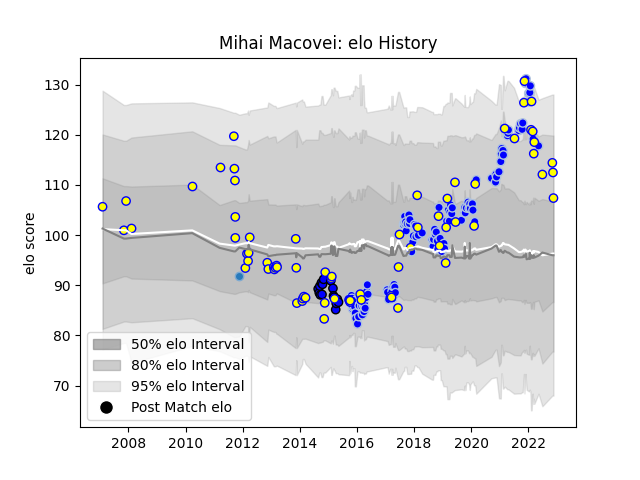

---  
layout: page  
title: Mihai Macovei  
date: 2023-02-04 18:30:23.142154  
categories: player  
---
# Mihai Macovei

## Positions: FL, N8

## Country: Romania

## Current elo: 106.0

## Current Percentile: 53.0

# Elo History

# Match History

| Team      |   Appearances |   Win Rate |
|:----------|--------------:|-----------:|
| Colomiers |           114 |   0.622807 |
| Romania   |            73 |   0.541096 |
| Massy     |            16 |   0.1875   |
| Bucuresti |             1 |   0        |

| Opponent                 |   Matches |   Win Rate |
|:-------------------------|----------:|-----------:|
| Georgia                  |        12 |   0.125    |
| Montauban                |        11 |   0.545455 |
| Beziers                  |        11 |   0.454545 |
| Spain                    |        10 |   0.6      |
| Aurillac                 |         9 |   0.777778 |
| Portugal                 |         8 |   0.875    |
| Russia                   |         8 |   0.75     |
| Carcassonne              |         8 |   0.625    |
| Provence Rugby           |         7 |   0.571429 |
| Perpignan                |         7 |   0.642857 |
| Mont-de-Marsan           |         7 |   0.5      |
| Biarritz Olympique       |         7 |   0.714286 |
| Oyonnax                  |         6 |   0.583333 |
| Narbonne                 |         6 |   0.583333 |
| Canada                   |         5 |   1        |
| Vannes                   |         5 |   0.4      |
| Rouen                    |         4 |   1        |
| Nevers                   |         4 |   0.5      |
| Soyaux-Angouleme         |         4 |   0.5      |
| Agen                     |         4 |   0.375    |
| Bayonne                  |         4 |   0.625    |
| Dax                      |         4 |   0.75     |
| Massy                    |         3 |   0.666667 |
| Uruguay                  |         3 |   0.333333 |
| Japan                    |         3 |   0        |
| US Bressane              |         3 |   0.666667 |
| Albi                     |         3 |   0        |
| Bourgoin-Jallieu         |         3 |   0.666667 |
| Brazil                   |         2 |   1        |
| United States of America |         2 |   0        |
| Tarbes                   |         2 |   0.5      |
| Argentina                |         2 |   0        |
| Samoa                    |         2 |   0.5      |
| Belgium                  |         2 |   1        |
| Germany                  |         2 |   1        |
| Colomiers                |         2 |   0        |
| Netherlands              |         2 |   1        |
| Lyon                     |         2 |   0.5      |
| Poland                   |         1 |   1        |
| Stade Francais Paris     |         1 |   0        |
| Ireland                  |         1 |   0        |
| Italy                    |         1 |   0        |
| Ukraine                  |         1 |   1        |
| Tonga                    |         1 |   1        |
| France                   |         1 |   0        |
| Fiji                     |         1 |   0        |
| Grenoble                 |         1 |   0        |
| England                  |         1 |   0        |
| Scotland                 |         1 |   0        |
| Roval Drome XV           |         1 |   1        |
| Pau                      |         1 |   0        |
| Chile                    |         1 |   1        |
| Brive                    |         1 |   1        |