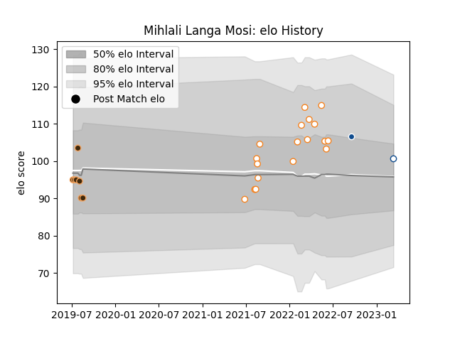

---  
layout: page  
title: Mihlali Langa Mosi  
date: 2023-03-16 11:31:39.289899  
categories: player  
---
# Mihlali Langa Mosi

## Positions: N8, L

## Current elo: 100.0

## Current Percentile: 80.0

# Elo History

# Match History

| Team                |   Appearances |   Win Rate |
|:--------------------|--------------:|-----------:|
| Free State Cheetahs |            18 |   0.583333 |
| Border Bulldogs     |             7 |   0.142857 |
| Blue Bulls          |             1 |   0        |
| Bulls               |             1 |   1        |

| Opponent               |   Matches |   Win Rate |
|:-----------------------|----------:|-----------:|
| Griquas                |         4 |   0.5      |
| Pumas                  |         4 |   0.25     |
| Blue Bulls             |         3 |   0.666667 |
| Natal Sharks           |         3 |   0.666667 |
| Western Province       |         3 |   0.666667 |
| Golden Lions           |         2 |   0.75     |
| Boland Cavaliers       |         1 |   0        |
| Eastern Province Kings |         1 |   0        |
| Griffons               |         1 |   0        |
| Jaguares XV            |         1 |   0        |
| Leopards               |         1 |   0        |
| Lions                  |         1 |   1        |
| SWD Eagles             |         1 |   1        |
| Valke                  |         1 |   0        |