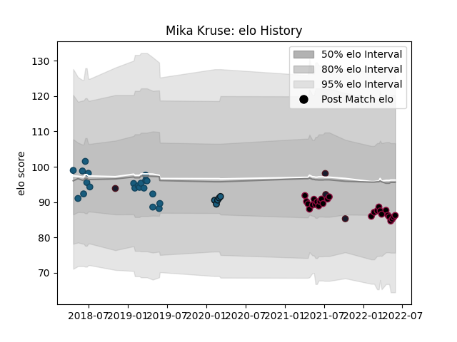

---  
layout: page  
title: Mika Kruse  
date: 2023-03-02 11:25:31.087179  
categories: player  
---
# Mika Kruse

## Positions: W, C

## Country: United States of America

## Current elo: 86.0

## Current Percentile: 23.0

# Elo History

# Match History

| Team                     |   Appearances |   Win Rate |
|:-------------------------|--------------:|-----------:|
| Utah Warriors            |            27 |   0.444444 |
| Glendale Raptors         |            21 |   0.571429 |
| Colorado Raptors         |             5 |   0.4      |
| United States of America |             4 |   0        |

| Opponent               |   Matches |   Win Rate |
|:-----------------------|----------:|-----------:|
| Houston SaberCats      |         7 |   0.428571 |
| San Diego Legion       |         7 |   0.357143 |
| Seattle Seawolves      |         6 |   0.333333 |
| L. A. Giltinis         |         5 |   0.4      |
| NOLA Gold              |         5 |   0.4      |
| Toronto Arrows         |         4 |   0.5      |
| Utah Warriors          |         3 |   0.833333 |
| R.U. New York          |         3 |   0.666667 |
| Austin Gilgronis       |         3 |   0.666667 |
| Rugby New York         |         2 |   0.5      |
| Austin Elite Rugby     |         2 |   1        |
| Old Glory DC           |         2 |   0.5      |
| New England Free Jacks |         2 |   0        |
| Rugby ATL              |         1 |   1        |
| Ireland                |         1 |   0        |
| England                |         1 |   0        |
| Dallas Jackals         |         1 |   1        |
| Uruguay                |         1 |   0        |
| New Zealand Maori      |         1 |   0        |