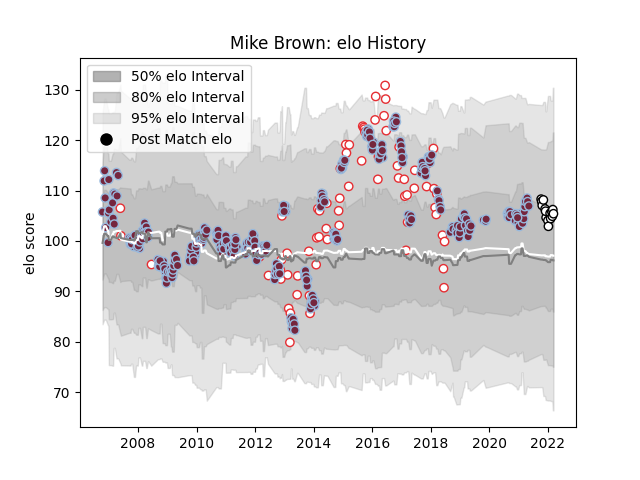

---  
layout: page  
title: Mike Brown  
date: 2023-03-16 21:12:46.677870  
categories: player  
---
# Mike Brown

## Positions: FB

## Country: England

## Current elo: 109.0

## Current Percentile: 80.0

# Elo History

# Match History

| Team              |   Appearances |   Win Rate |
|:------------------|--------------:|-----------:|
| Harlequins        |           324 |   0.572531 |
| England           |            75 |   0.666667 |
| Newcastle Falcons |            16 |   0.28125  |
| Leicester Tigers  |             4 |   1        |

| Opponent             |   Matches |   Win Rate |
|:---------------------|----------:|-----------:|
| Saracens             |        28 |   0.285714 |
| Gloucester Rugby     |        26 |   0.596154 |
| Northampton Saints   |        26 |   0.538462 |
| Wasps                |        26 |   0.634615 |
| London Irish         |        26 |   0.615385 |
| Worcester Warriors   |        24 |   0.854167 |
| Leicester Tigers     |        22 |   0.340909 |
| Bath Rugby           |        22 |   0.659091 |
| Sale Sharks          |        21 |   0.619048 |
| Newcastle Falcons    |        19 |   0.710526 |
| Exeter Chiefs        |        19 |   0.315789 |
| Bristol Rugby        |        12 |   0.583333 |
| South Africa         |         9 |   0.222222 |
| Wales                |         9 |   0.666667 |
| Australia            |         8 |   0.75     |
| France               |         8 |   0.625    |
| Stade Francais Paris |         8 |   0.625    |
| Scotland             |         7 |   0.857143 |
| Argentina            |         7 |   1        |
| New Zealand          |         7 |   0.142857 |
| Ireland              |         7 |   0.714286 |
| Italy                |         7 |   1        |
| Connacht             |         5 |   0.8      |
| Leeds                |         5 |   1        |
| Scarlets             |         4 |   0.625    |
| Cardiff Blues        |         4 |   0.375    |
| Stade Toulousain     |         4 |   0.25     |
| Ulster               |         4 |   0.25     |
| Clermont Auvergne    |         4 |   0        |
| Biarritz Olympique   |         3 |   1        |
| Yorkshire Carnegie   |         3 |   1        |
| Munster              |         3 |   0.333333 |
| Racing 92            |         3 |   0.666667 |
| Leinster             |         3 |   0.333333 |
| Samoa                |         2 |   1        |
| Agen                 |         2 |   1        |
| Montpellier Herault  |         2 |   0.5      |
| London Welsh         |         2 |   1        |
| Grenoble             |         2 |   1        |
| Fiji                 |         2 |   1        |
| Edinburgh            |         2 |   0        |
| Castres Olympique    |         2 |   1        |
| Zebre                |         2 |   1        |
| La Rochelle          |         1 |   0        |
| Harlequins           |         1 |   0        |
| Timisoara Saracens   |         1 |   1        |
| Toulon               |         1 |   0        |
| Uruguay              |         1 |   1        |
| Benetton Treviso     |         1 |   0        |
| Bayonne              |         1 |   0        |
| Barbarians           |         1 |   0        |