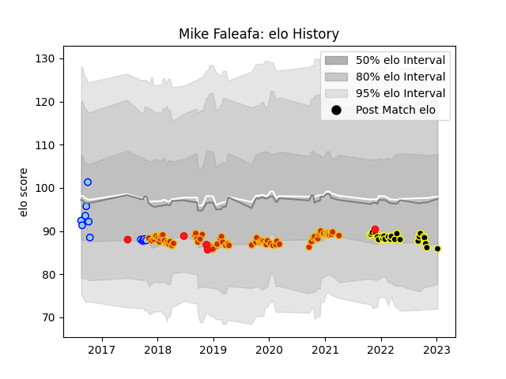

---  
layout: page  
title: Mike Faleafa  
date: 2023-01-13 11:29:55.788204  
categories: player  
---
# Mike Faleafa

## Positions: N8, FL

## Country: Tonga

## Current elo: 86.0

## Current Percentile: 23.0

# Elo History

# Match History

| Team           |   Appearances |   Win Rate |
|:---------------|--------------:|-----------:|
| Perpignan      |            65 |   0.592308 |
| Mont-de-Marsan |            24 |   0.666667 |
| Northland      |            12 |   0.25     |
| Tonga          |             5 |   0.2      |

| Opponent            |   Matches |   Win Rate |
|:--------------------|----------:|-----------:|
| Grenoble            |         7 |   0.571429 |
| Soyaux-Angouleme    |         7 |   0.928571 |
| Montauban           |         6 |   0.666667 |
| Aurillac            |         5 |   0.9      |
| Vannes              |         5 |   0.8      |
| Beziers             |         5 |   0.4      |
| Nevers              |         5 |   0.4      |
| Colomiers           |         5 |   0.8      |
| Biarritz Olympique  |         4 |   1        |
| Mont-de-Marsan      |         4 |   0.5      |
| Oyonnax             |         3 |   0.666667 |
| Massy               |         3 |   0.333333 |
| Agen                |         3 |   0        |
| Bayonne             |         3 |   1        |
| Carcassonne         |         3 |   1        |
| Pau                 |         2 |   0        |
| Narbonne            |         2 |   1        |
| Wales               |         2 |   0        |
| Bordeaux Begles     |         2 |   0.25     |
| Rouen               |         2 |   0.5      |
| North Harbour       |         2 |   0        |
| Wellington          |         2 |   0        |
| Lyon                |         2 |   0        |
| Roval Drome XV      |         1 |   1        |
| Dax                 |         1 |   1        |
| Waikato             |         1 |   1        |
| Hawke's Bay         |         1 |   1        |
| US Bressane         |         1 |   1        |
| Toulon              |         1 |   0        |
| Tasman              |         1 |   0        |
| La Rochelle         |         1 |   0        |
| Southland           |         1 |   0        |
| Sale Sharks         |         1 |   0        |
| Auckland            |         1 |   0        |
| Montpellier Herault |         1 |   1        |
| Romania             |         1 |   0        |
| Racing 92           |         1 |   0        |
| Provence Rugby      |         1 |   1        |
| Georgia             |         1 |   0        |
| Manawatu            |         1 |   0        |
| Otago               |         1 |   1        |
| Counties Manukau    |         1 |   0        |
| Clermont Auvergne   |         1 |   0        |
| Connacht            |         1 |   0        |
| Fiji                |         1 |   1        |