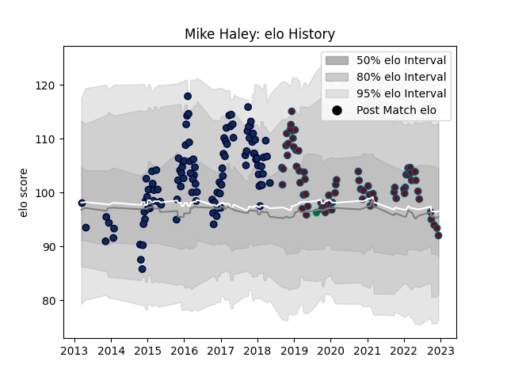

---  
layout: page  
title: Mike Haley  
date: 2023-01-06 00:21:54.926905  
categories: player  
---
# Mike Haley

## Positions: FB

## Country: Ireland

## Current elo: 108.0

## Current Percentile: 56.0

# Elo History

# Match History

| Team        |   Appearances |   Win Rate |
|:------------|--------------:|-----------:|
| Sale Sharks |           111 |   0.472973 |
| Munster     |            75 |   0.733333 |
| Ireland     |             1 |   1        |

| Opponent            |   Matches |   Win Rate |
|:--------------------|----------:|-----------:|
| Saracens            |        15 |   0.3      |
| Northampton Saints  |         9 |   0.555556 |
| Harlequins          |         9 |   0.555556 |
| Exeter Chiefs       |         9 |   0.388889 |
| Bath Rugby          |         8 |   0.375    |
| Leicester Tigers    |         8 |   0.25     |
| Wasps               |         8 |   0.5      |
| Scarlets            |         8 |   0.75     |
| Gloucester Rugby    |         8 |   0.5      |
| Ospreys             |         7 |   0.857143 |
| Cardiff Blues       |         7 |   0.857143 |
| Ulster              |         7 |   0.571429 |
| Newcastle Falcons   |         6 |   0.75     |
| London Irish        |         6 |   0.833333 |
| Connacht            |         6 |   0.833333 |
| Worcester Warriors  |         6 |   0.833333 |
| Castres Olympique   |         5 |   0.8      |
| Leinster            |         5 |   0.2      |
| Dragons             |         5 |   0.8      |
| Zebre               |         4 |   1        |
| Edinburgh           |         4 |   1        |
| Glasgow Warriors    |         4 |   0.5      |
| Stade Toulousain    |         3 |   0.166667 |
| Southern Kings      |         3 |   1        |
| Benetton Treviso    |         3 |   1        |
| Pau                 |         2 |   1        |
| Racing 92           |         2 |   0.25     |
| Lyon                |         2 |   0.5      |
| Clermont Auvergne   |         2 |   0        |
| Munster             |         2 |   0        |
| Toulon              |         2 |   0        |
| Cheetahs            |         2 |   1        |
| Bristol Rugby       |         2 |   0.5      |
| Italy               |         1 |   1        |
| Lions               |         1 |   0        |
| Oyonnax             |         1 |   0        |
| Sharks              |         1 |   1        |
| Montpellier Herault |         1 |   0        |
| Stormers            |         1 |   1        |
| Bulls               |         1 |   0        |
| London Welsh        |         1 |   1        |