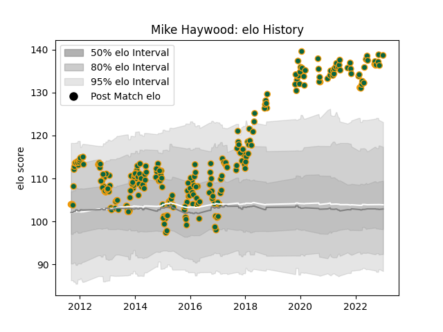

---  
layout: page  
title: Mike Haywood  
date: 2022-12-31 16:28:52.337187  
categories: player  
---
# Mike Haywood

## Positions: H

## Current elo: 130.0

## Current Percentile: 99.0

# Elo History

# Match History

| Team               |   Appearances |   Win Rate |
|:-------------------|--------------:|-----------:|
| Northampton Saints |           265 |   0.569811 |

| Opponent            |   Matches |   Win Rate |
|:--------------------|----------:|-----------:|
| Saracens            |        24 |   0.416667 |
| Leicester Tigers    |        22 |   0.295455 |
| Harlequins          |        22 |   0.590909 |
| Exeter Chiefs       |        20 |   0.4      |
| Gloucester Rugby    |        19 |   0.710526 |
| Sale Sharks         |        19 |   0.473684 |
| Wasps               |        17 |   0.647059 |
| Bath Rugby          |        16 |   0.65625  |
| Worcester Warriors  |        16 |   0.8125   |
| Newcastle Falcons   |        14 |   0.571429 |
| London Irish        |        14 |   0.714286 |
| Bristol Rugby       |         8 |   0.625    |
| Castres Olympique   |         8 |   0.5      |
| Ospreys             |         7 |   0.714286 |
| Scarlets            |         5 |   0.8      |
| Clermont Auvergne   |         4 |   0.25     |
| Racing 92           |         4 |   0.125    |
| Glasgow Warriors    |         4 |   0.75     |
| Dragons             |         4 |   1        |
| Leinster            |         4 |   0.25     |
| London Welsh        |         4 |   1        |
| Benetton Treviso    |         3 |   1        |
| Montpellier Herault |         2 |   0.5      |
| Lyon                |         2 |   1        |
| Ulster              |         2 |   0.5      |
| Munster             |         1 |   0        |