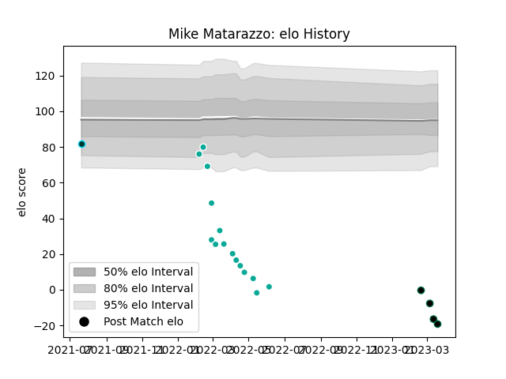

---  
layout: page  
title: Mike Matarazzo  
date: 2023-03-21 18:40:44.195901  
categories: player  
---
# Mike Matarazzo

Last updated: 2023-03-21
## Positions: FL, L

## Current elo: -19.0

## Current Percentile: 0.0

# Elo History

# Match History

| Team           |   Appearances |   Win Rate |
|:---------------|--------------:|-----------:|
| Dallas Jackals |            15 |       0    |
| Chicago Hounds |             4 |       0.25 |
| Rugby ATL      |             1 |       0    |

| Opponent               |   Matches |   Win Rate |
|:-----------------------|----------:|-----------:|
| Utah Warriors          |         3 |          0 |
| Austin Gilgronis       |         2 |          0 |
| Houston SaberCats      |         2 |          0 |
| Old Glory DC           |         2 |          0 |
| Seattle Seawolves      |         2 |          0 |
| Toronto Arrows         |         2 |          0 |
| Dallas Jackals         |         1 |          1 |
| L. A. Giltinis         |         1 |          0 |
| NOLA Gold              |         1 |          0 |
| New England Free Jacks |         1 |          0 |
| R.U. New York          |         1 |          0 |
| Rugby New York         |         1 |          0 |
| San Diego Legion       |         1 |          0 |