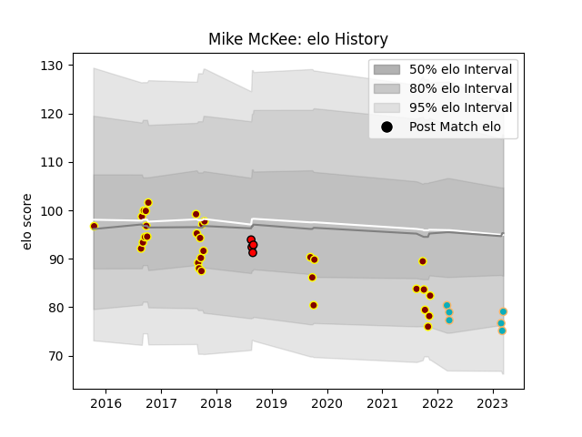

---  
layout: page  
title: Mike McKee  
date: 2023-03-21 18:39:53.022470  
categories: player  
---
# Mike McKee

Last updated: 2023-03-21
## Positions: L

## Current elo: 77.0

## Current Percentile: 12.0

# Elo History

# Match History

| Team             |   Appearances |   Win Rate |
|:-----------------|--------------:|-----------:|
| Southland        |            31 |  0.0967742 |
| Moana Pasifika   |             7 |  0         |
| Counties Manukau |             4 |  0.25      |

| Opponent      |   Matches |   Win Rate |
|:--------------|----------:|-----------:|
| Bay of Plenty |         5 |   0.2      |
| Taranaki      |         5 |   0        |
| Auckland      |         4 |   0        |
| Manawatu      |         4 |   0        |
| Canterbury    |         3 |   0        |
| Chiefs        |         3 |   0        |
| Hawke's Bay   |         3 |   0.333333 |
| Northland     |         3 |   0.666667 |
| North Harbour |         2 |   0        |
| Otago         |         2 |   0        |
| Tasman        |         2 |   0        |
| Wellington    |         2 |   0        |
| Brumbies      |         1 |   0        |
| Crusaders     |         1 |   0        |
| Fijian Drua   |         1 |   0        |
| Western Force |         1 |   0        |