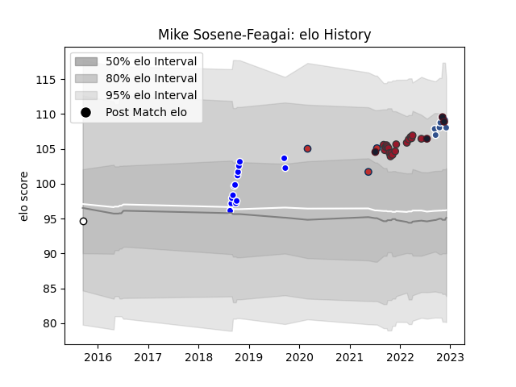

---  
layout: page  
title: Mike Sosene-Feagai  
date: 2022-12-12 15:05:41.426922  
categories: player  
---
# Mike Sosene-Feagai

## Positions: H

## Country: United States of America

## Current elo: 108.0

## Current Percentile: 89.0

# Elo History

# Match History

| Team                     |   Appearances |   Win Rate |
|:-------------------------|--------------:|-----------:|
| Toulon                   |            18 |   0.555556 |
| Auckland                 |            14 |   0.857143 |
| San Diego                |            11 |   0.272727 |
| Agen                     |             7 |   0.571429 |
| United States of America |             4 |   0.375    |
| Old Glory DC             |             3 |   1        |
| Hawke's Bay              |             1 |   0        |

| Opponent             |   Matches |   Win Rate |
|:---------------------|----------:|-----------:|
| Wellington           |         3 |   0.666667 |
| Canterbury           |         3 |   0.666667 |
| Sacramento           |         3 |   0.666667 |
| Denver               |         3 |   0        |
| Ohio                 |         3 |   0.333333 |
| Biarritz Olympique   |         3 |   1        |
| Lyon                 |         2 |   1        |
| Perpignan            |         2 |   0.5      |
| Clermont Auvergne    |         2 |   0.5      |
| Racing 92            |         2 |   0        |
| Counties Manukau     |         2 |   1        |
| San Francisco        |         2 |   0        |
| La Rochelle          |         2 |   0.5      |
| Portugal             |         1 |   0.5      |
| Seattle Seawolves    |         1 |   1        |
| Waikato              |         1 |   1        |
| Vannes               |         1 |   1        |
| Stade Francais Paris |         1 |   1        |
| Pau                  |         1 |   0.5      |
| Stade Toulousain     |         1 |   0        |
| Taranaki             |         1 |   1        |
| Tasman               |         1 |   1        |
| Southland            |         1 |   1        |
| Austin Gilgronis     |         1 |   1        |
| Otago                |         1 |   0        |
| Northland            |         1 |   1        |
| North Harbour        |         1 |   1        |
| Austin Herd          |         1 |   1        |
| Montauban            |         1 |   0        |
| Mont-de-Marsan       |         1 |   1        |
| Massy                |         1 |   1        |
| Kenya                |         1 |   1        |
| England              |         1 |   0        |
| Colomiers            |         1 |   0        |
| Chile                |         1 |   0        |
| Castres Olympique    |         1 |   0        |
| Carcassonne          |         1 |   0        |
| Brive                |         1 |   1        |
| Montpellier Herault  |         1 |   0.5      |