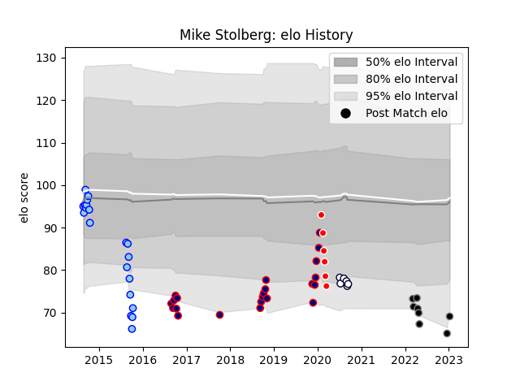

---  
layout: page  
title: Mike Stolberg  
date: 2023-01-13 11:39:35.411779  
categories: player  
---
# Mike Stolberg

## Positions: L

## Current elo: 69.0

## Current Percentile: 4.0

# Elo History

# Match History

| Team                     |   Appearances |   Win Rate |
|:-------------------------|--------------:|-----------:|
| Hanazono Kintetsu Liners |            22 |   0.727273 |
| Northland                |            20 |   0.25     |
| Black Rams Tokyo         |             8 |   0.25     |
| Melbourne Rebels         |             6 |   0.416667 |
| Sunwolves                |             6 |   0.166667 |

| Opponent                          |   Matches |   Win Rate |
|:----------------------------------|----------:|-----------:|
| Brumbies                          |         3 |   0.333333 |
| Toyota Verblitz                   |         3 |   0.333333 |
| Queensland Reds                   |         3 |   0.166667 |
| Hawke's Bay                       |         3 |   0.333333 |
| Auckland                          |         2 |   0        |
| Kamaishi Seawaves                 |         2 |   1        |
| Munakata Sanix Blues              |         2 |   0.5      |
| Mitsubishi Dynaboars              |         2 |   0.5      |
| Bay of Plenty                     |         2 |   0.5      |
| Mazda Blue Zoomers                |         2 |   1        |
| Kyuden Voltex                     |         2 |   1        |
| Kurita Water Gush                 |         2 |   1        |
| Otago                             |         2 |   0.5      |
| North Harbour                     |         2 |   0.5      |
| Southland                         |         2 |   0        |
| Taranaki                          |         2 |   0        |
| Tokyo Sungoliath                  |         2 |   0        |
| Wellington                        |         2 |   0.5      |
| Shimizu Blue Sharks               |         1 |   1        |
| Saitama Wild Knights              |         1 |   0        |
| Toshiba Brave Lupus Tokyo         |         1 |   0        |
| Toyota Industries Shuttles Aichi  |         1 |   1        |
| Urayasu D-Rocks                   |         1 |   0        |
| Shizuoka Blue Revs                |         1 |   0        |
| Melbourne Rebels                  |         1 |   1        |
| New South Wales Waratahs          |         1 |   0        |
| NTT Docomo Red Hurricanes Osaka   |         1 |   1        |
| Manawatu                          |         1 |   0        |
| Kubota Spears Funabashi Tokyo-Bay |         1 |   1        |
| Kobelco Kobe Steelers             |         1 |   0        |
| Hurricanes                        |         1 |   0        |
| Green Rockets Tokatsu             |         1 |   1        |
| Crusaders                         |         1 |   0        |
| Counties Manukau                  |         1 |   0        |
| Coca-Cola Red Sparks              |         1 |   1        |
| Chugoku Red Regulions             |         1 |   1        |
| Chiefs                            |         1 |   0        |
| Canterbury                        |         1 |   0        |
| Black Rams Tokyo                  |         1 |   0        |
| Western Force                     |         1 |   1        |