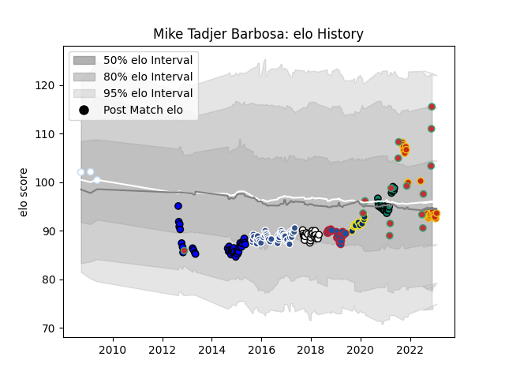

---  
layout: page  
title: Mike Tadjer Barbosa  
date: 2022-11-22 11:47:57.965495  
categories: player  
---
# Mike Tadjer Barbosa

## Positions: H

## Country: Portugal

## Current elo: 101.0

## Current Percentile: 11.0

# Elo History

# Match History

| Team              |   Appearances |   Win Rate |
|:------------------|--------------:|-----------:|
| Agen              |            38 |   0.342105 |
| Brive             |            25 |   0.24     |
| Massy             |            23 |   0.347826 |
| Grenoble          |            20 |   0.25     |
| Perpignan         |            19 |   0.421053 |
| Montauban         |            15 |   0.433333 |
| Portugal          |            14 |   0.464286 |
| Clermont Auvergne |            10 |   0.7      |

| Opponent                   |   Matches |   Win Rate |
|:---------------------------|----------:|-----------:|
| Pau                        |        10 |   0.1      |
| Agen                       |         7 |   0.5      |
| Toulon                     |         7 |   0.571429 |
| Stade Toulousain           |         7 |   0        |
| Stade Francais Paris       |         7 |   0.571429 |
| Clermont Auvergne          |         7 |   0.214286 |
| Bordeaux Begles            |         6 |   0.333333 |
| Montpellier Herault        |         6 |   0.333333 |
| Lyon                       |         6 |   0.166667 |
| La Rochelle                |         6 |   0.333333 |
| Aurillac                   |         6 |   0.5      |
| Oyonnax                    |         5 |   0.4      |
| Biarritz Olympique         |         5 |   0.4      |
| Colomiers                  |         5 |   0.1      |
| Racing 92                  |         5 |   0.2      |
| Brive                      |         4 |   0        |
| Carcassonne                |         4 |   0.5      |
| Castres Olympique          |         4 |   0.5      |
| Beziers                    |         3 |   0        |
| Narbonne                   |         3 |   0.666667 |
| Grenoble                   |         3 |   0.166667 |
| Georgia                    |         3 |   0        |
| Harlequins                 |         3 |   0.666667 |
| Tarbes                     |         2 |   0.5      |
| Soyaux-Angouleme           |         2 |   1        |
| Romania                    |         2 |   0.5      |
| Valence Romans Drome Rugby |         2 |   0.5      |
| Vannes                     |         2 |   0.75     |
| Provence Rugby             |         2 |   0.5      |
| Perpignan                  |         2 |   0.5      |
| Bourgoin-Jallieu           |         2 |   0.5      |
| Worcester Warriors         |         2 |   0.5      |
| Connacht                   |         2 |   0        |
| Dax                        |         2 |   1        |
| Montauban                  |         2 |   0.5      |
| Mont-de-Marsan             |         2 |   0.5      |
| Albi                       |         2 |   0.5      |
| Auch                       |         1 |   0        |
| United States of America   |         1 |   0.5      |
| Ulster                     |         1 |   0        |
| Argentina                  |         1 |   0        |
| Hong Kong                  |         1 |   1        |
| Netherlands                |         1 |   1        |
| Italy                      |         1 |   0        |
| Nevers                     |         1 |   1        |
| Japan                      |         1 |   0        |
| Russia                     |         1 |   1        |
| Kenya                      |         1 |   1        |
| Bayonne                    |         1 |   0        |
| Benetton Treviso           |         1 |   0        |
| Spain                      |         1 |   1        |