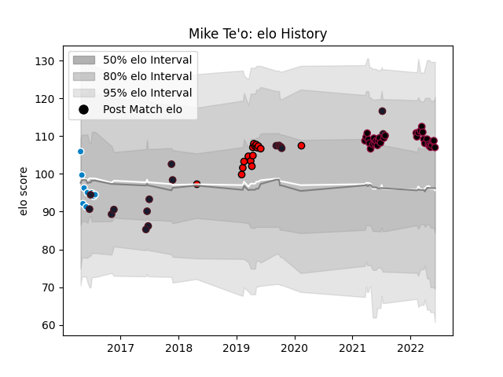

---  
layout: page  
title: Mike Te'o  
date: 2023-03-21 18:05:01.029807  
categories: player  
---
# Mike Te'o

Last updated: 2023-03-21
## Positions: FB, W

## Country: United States of America

## Current elo: 107.0

## Current Percentile: 75.0

# Elo History

# Match History

| Team                     |   Appearances |   Win Rate |
|:-------------------------|--------------:|-----------:|
| Utah Warriors            |            32 |   0.46875  |
| United States of America |            17 |   0.264706 |
| San Diego Legion         |            16 |   0.84375  |
| San Diego                |            10 |   0.4      |

| Opponent               |   Matches |   Win Rate |
|:-----------------------|----------:|-----------:|
| Seattle Seawolves      |         8 |   0.5      |
| Houston SaberCats      |         6 |   0.666667 |
| L. A. Giltinis         |         5 |   0.4      |
| San Diego Legion       |         4 |   0.25     |
| NOLA Gold              |         3 |   0.666667 |
| Austin Gilgronis       |         3 |   0.666667 |
| Toronto Arrows         |         3 |   0.333333 |
| Canada                 |         3 |   0.833333 |
| Denver                 |         3 |   0        |
| Sacramento             |         3 |   0.666667 |
| New England Free Jacks |         2 |   0        |
| Tonga                  |         2 |   0        |
| San Francisco          |         2 |   0.5      |
| R.U. New York          |         2 |   1        |
| Old Glory DC           |         2 |   0.5      |
| Ohio                   |         2 |   0.5      |
| Utah Warriors          |         2 |   1        |
| Ireland                |         2 |   0        |
| Glendale Raptors       |         2 |   0.75     |
| Georgia                |         2 |   0        |
| England                |         2 |   0        |
| Dallas Jackals         |         2 |   1        |
| Austin Elite Rugby     |         1 |   1        |
| New Zealand Maori      |         1 |   0        |
| Italy                  |         1 |   0        |
| Rugby ATL              |         1 |   1        |
| Rugby New York         |         1 |   1        |
| Russia                 |         1 |   1        |
| Germany                |         1 |   1        |
| France                 |         1 |   0        |
| Austin Herd            |         1 |   1        |
| Argentina              |         1 |   0        |