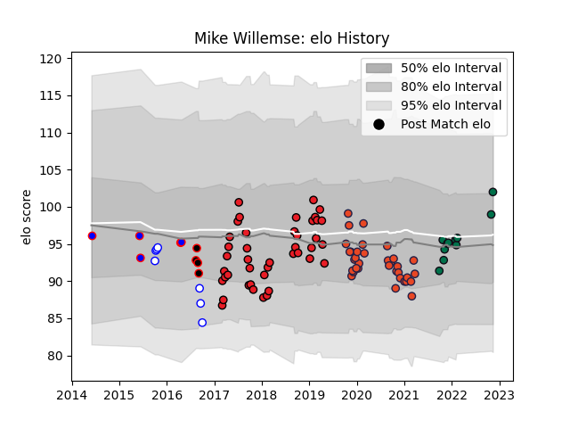

---  
layout: page  
title: Mike Willemse  
date: 2022-11-22 11:44:41.749095  
categories: player  
---
# Mike Willemse

## Positions: H

## Current elo: 102.0

## Current Percentile: 66.0

# Elo History

# Match History

| Team                   |   Appearances |   Win Rate |
|:-----------------------|--------------:|-----------:|
| Southern Kings         |            42 |   0.202381 |
| Edinburgh              |            34 |   0.573529 |
| London Irish           |            11 |   0.545455 |
| Western Province       |             7 |   0.571429 |
| Stormers               |             5 |   0.5      |
| Eastern Province Kings |             4 |   0        |

| Opponent                 |   Matches |   Win Rate |
|:-------------------------|----------:|-----------:|
| Glasgow Warriors         |         8 |   0.5      |
| Scarlets                 |         6 |   0.5      |
| Cheetahs                 |         6 |   0        |
| Ulster                   |         5 |   0        |
| Cardiff Blues            |         5 |   0.6      |
| Dragons                  |         5 |   0.5      |
| Leinster                 |         4 |   0        |
| Munster                  |         4 |   0.25     |
| Connacht                 |         4 |   0.5      |
| Sharks                   |         3 |   0.333333 |
| Lions                    |         3 |   0.166667 |
| Benetton Treviso         |         3 |   0        |
| Golden Lions             |         3 |   0        |
| Zebre                    |         3 |   0.333333 |
| Exeter Chiefs            |         3 |   0.666667 |
| Bordeaux Begles          |         3 |   0.166667 |
| Agen                     |         2 |   1        |
| Wasps                    |         2 |   1        |
| Queensland Reds          |         2 |   0.5      |
| Ospreys                  |         2 |   0        |
| Bristol Rugby            |         2 |   0.5      |
| Blue Bulls               |         2 |   0.5      |
| Jaguares                 |         2 |   0.5      |
| Harlequins               |         2 |   0.5      |
| Edinburgh                |         2 |   0.5      |
| Boland Cavaliers         |         2 |   0.5      |
| Western Force            |         1 |   0        |
| Sunwolves                |         1 |   1        |
| Stormers                 |         1 |   0        |
| Western Province         |         1 |   0        |
| Southern Kings           |         1 |   1        |
| Free State Cheetahs      |         1 |   0        |
| Saracens                 |         1 |   0.5      |
| Sale Sharks              |         1 |   0.5      |
| Newcastle Falcons        |         1 |   1        |
| New South Wales Waratahs |         1 |   1        |
| Melbourne Rebels         |         1 |   1        |
| Bulls                    |         1 |   1        |
| Eastern Province Kings   |         1 |   1        |
| Gloucester Rugby         |         1 |   0        |
| Pumas                    |         1 |   1        |