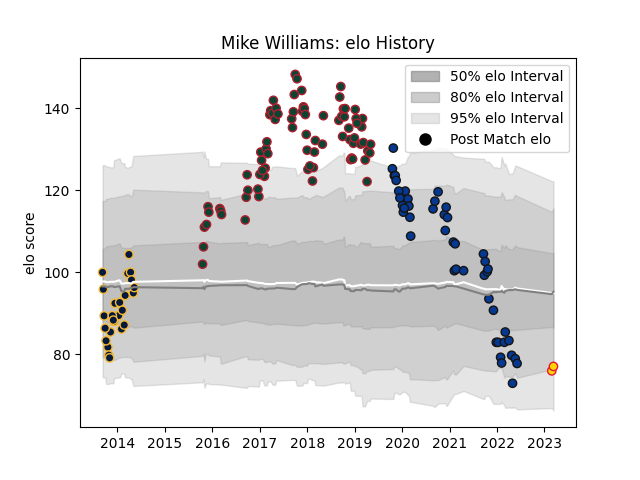

---  
layout: page  
title: Mike Williams  
date: 2023-03-02 11:27:02.331916  
categories: player  
---
# Mike Williams

## Positions: FL, L

## Current elo: 78.0

## Current Percentile: 15.0

# Elo History

# Match History

| Team               |   Appearances |   Win Rate |
|:-------------------|--------------:|-----------:|
| Leicester Tigers   |            79 |   0.455696 |
| Bath Rugby         |            45 |   0.366667 |
| Worcester Warriors |            25 |   0.16     |

| Opponent             |   Matches |   Win Rate |
|:---------------------|----------:|-----------:|
| Exeter Chiefs        |        15 |   0.266667 |
| Harlequins           |        13 |   0.538462 |
| Wasps                |        12 |   0.166667 |
| Sale Sharks          |        12 |   0.416667 |
| Worcester Warriors   |        11 |   0.636364 |
| Newcastle Falcons    |        10 |   0.6      |
| Saracens             |        10 |   0.15     |
| Gloucester Rugby     |        10 |   0.5      |
| Northampton Saints   |         9 |   0.444444 |
| Bristol Rugby        |         8 |   0.25     |
| Bath Rugby           |         7 |   0.285714 |
| London Irish         |         5 |   0.8      |
| Racing 92            |         5 |   0        |
| Leicester Tigers     |         4 |   0.5      |
| Ulster               |         4 |   0        |
| Scarlets             |         3 |   0.333333 |
| Munster              |         3 |   0.333333 |
| Biarritz Olympique   |         2 |   0        |
| Clermont Auvergne    |         2 |   0        |
| Oyonnax              |         1 |   1        |
| Glasgow Warriors     |         1 |   0        |
| Stade Francais Paris |         1 |   1        |
| Cardiff Blues        |         1 |   1        |