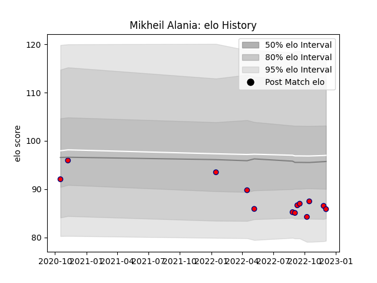

---  
layout: page  
title: Mikheil Alania  
date: 2023-01-13 11:33:17.367904  
categories: player  
---
# Mikheil Alania

## Positions: SH

## Country: Georgia

## Current elo: 91.0

## Current Percentile: 37.0

# Elo History

# Match History

| Team     |   Appearances |   Win Rate |
|:---------|--------------:|-----------:|
| Aurillac |            20 |        0.4 |
| Georgia  |             5 |        0.8 |

| Opponent         |   Matches |   Win Rate |
|:-----------------|----------:|-----------:|
| Oyonnax          |         3 |   0        |
| Montauban        |         3 |   0.666667 |
| Carcassonne      |         2 |   0.5      |
| Provence Rugby   |         2 |   0.5      |
| Mont-de-Marsan   |         2 |   0        |
| Agen             |         1 |   0        |
| Spain            |         1 |   1        |
| Soyaux-Angouleme |         1 |   1        |
| Russia           |         1 |   1        |
| Portugal         |         1 |   1        |
| Netherlands      |         1 |   1        |
| Nevers           |         1 |   1        |
| Bayonne          |         1 |   0        |
| Massy            |         1 |   1        |
| France           |         1 |   0        |
| Colomiers        |         1 |   1        |
| Beziers          |         1 |   0        |
| Vannes           |         1 |   0        |