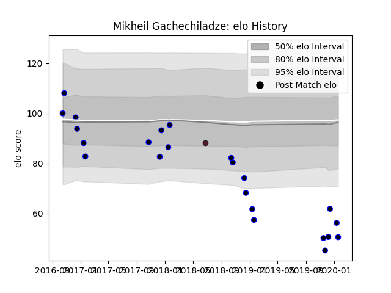

---  
layout: page  
title: Mikheil Gachechiladze  
date: 2023-02-16 11:17:43.806320  
categories: player  
---
# Mikheil Gachechiladze

## Positions: FL

## Country: Georgia

## Current elo: 50.0

## Current Percentile: None

# Elo History

# Match History

| Team      |   Appearances |   Win Rate |
|:----------|--------------:|-----------:|
| RC Enisei |            23 |  0.0869565 |
| Georgia   |             1 |  0         |

| Opponent           |   Matches |   Win Rate |
|:-------------------|----------:|-----------:|
| Dragons            |         6 |   0.166667 |
| Worcester Warriors |         4 |   0.25     |
| Bristol Rugby      |         2 |   0        |
| Brive              |         2 |   0        |
| Castres Olympique  |         2 |   0        |
| La Rochelle        |         2 |   0        |
| Newcastle Falcons  |         2 |   0        |
| Zebre              |         2 |   0        |
| Bordeaux Begles    |         1 |   0        |
| Japan              |         1 |   0        |