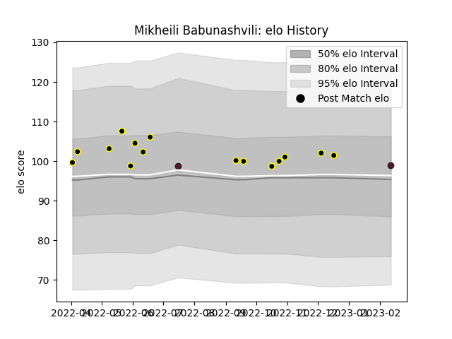

---  
layout: page  
title: Mikheili Babunashvili  
date: 2023-02-16 11:18:50.126523  
categories: player  
---
# Mikheili Babunashvili

## Positions: L

## Country: Georgia

## Current elo: 99.0

## Current Percentile: 64.0

# Elo History

# Match History

| Team       |   Appearances |   Win Rate |
|:-----------|--------------:|-----------:|
| Black Lion |            15 |   0.766667 |
| Georgia    |             2 |   1        |

| Opponent                 |   Matches |   Win Rate |
|:-------------------------|----------:|-----------:|
| Tel-Aviv Heat            |         3 |        0.5 |
| RC Batumi                |         2 |        1   |
| Boland Cavaliers         |         1 |        0   |
| Border Bulldogs          |         1 |        1   |
| Castilla y Leon Iberians |         1 |        1   |
| Eastern Province Kings   |         1 |        1   |
| Griffons                 |         1 |        0   |
| Leopards                 |         1 |        1   |
| Lusitanos XV             |         1 |        1   |
| Netherlands              |         1 |        1   |
| Portugal                 |         1 |        1   |
| Romanian Wolves          |         1 |        1   |
| SWD Eagles               |         1 |        1   |
| Zimbabwe Goshawks        |         1 |        1   |