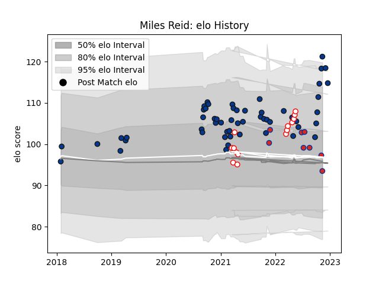

---  
layout: page  
title: Miles Reid  
date: 2022-12-12 15:31:57.870262  
categories: player  
---
# Miles Reid

## Positions: FL, W

## Country: Chile

## Current elo: 93.0

## Current Percentile: 95.0

# Elo History

# Match History

| Team       |   Appearances |   Win Rate |
|:-----------|--------------:|-----------:|
| Bath Rugby |            53 |   0.424528 |
| Selknam    |            14 |   0.642857 |
| Chile      |             8 |   0.5      |

| Opponent                 |   Matches |   Win Rate |
|:-------------------------|----------:|-----------:|
| Newcastle Falcons        |         6 |   0.666667 |
| Saracens                 |         5 |   0.3      |
| Gloucester Rugby         |         5 |   0.4      |
| Harlequins               |         5 |   0.2      |
| Northampton Saints       |         5 |   0.8      |
| Worcester Warriors       |         4 |   0.75     |
| Wasps                    |         4 |   0        |
| Exeter Chiefs            |         4 |   0        |
| Jaguares XV              |         4 |   0.5      |
| Leicester Tigers         |         4 |   0.5      |
| Bristol Rugby            |         4 |   0.25     |
| Penarol Rugby            |         3 |   0.666667 |
| Sale Sharks              |         3 |   0.666667 |
| Olimpia Lions            |         3 |   0.333333 |
| London Irish             |         3 |   0.333333 |
| Russia                   |         2 |   1        |
| Cobras                   |         2 |   1        |
| United States of America |         2 |   0.5      |
| Cafeteros Pro            |         2 |   1        |
| Ospreys                  |         1 |   1        |
| Romania                  |         1 |   0        |
| Scotland                 |         1 |   0        |
| Tonga                    |         1 |   0        |
| Brazil                   |         1 |   1        |