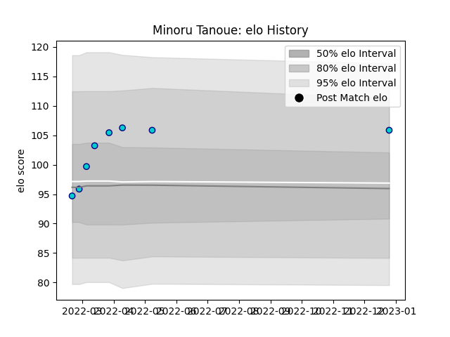

---  
layout: page  
title: Minoru Tanoue  
date: 2023-01-13 11:27:46.076577  
categories: player  
---
# Minoru Tanoue

## Positions: SH

## Current elo: 106.0

## Current Percentile: 75.0

# Elo History

# Match History

| Team               |   Appearances |   Win Rate |
|:-------------------|--------------:|-----------:|
| Shizuoka Blue Revs |             9 |   0.333333 |

| Opponent                          |   Matches |   Win Rate |
|:----------------------------------|----------:|-----------:|
| Saitama Wild Knights              |         2 |          0 |
| Toshiba Brave Lupus Tokyo         |         2 |          0 |
| Black Rams Tokyo                  |         1 |          1 |
| Green Rockets Tokatsu             |         1 |          1 |
| Kubota Spears Funabashi Tokyo-Bay |         1 |          0 |
| Urayasu D-Rocks                   |         1 |          1 |
| Yokohama Canon Eagles             |         1 |          0 |