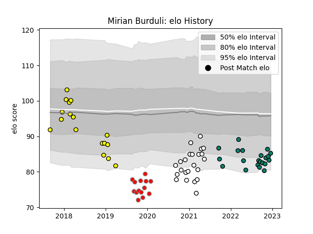

---  
layout: page  
title: Mirian Burduli  
date: 2022-11-22 11:28:09.661618  
categories: player  
---
# Mirian Burduli

## Positions: P

## Current elo: 85.0

## Current Percentile: 7.0

# Elo History

# Match History

| Team                       |   Appearances |   Win Rate |
|:---------------------------|--------------:|-----------:|
| Valence Romans Drome Rugby |            23 |   0.413043 |
| Montauban                  |            18 |   0.444444 |
| Carcassonne                |            17 |   0.411765 |
| Roval Drome XV             |            14 |   0.214286 |

| Opponent           |   Matches |   Win Rate |
|:-------------------|----------:|-----------:|
| Colomiers          |         8 |   0.375    |
| Mont-de-Marsan     |         7 |   0.5      |
| Aurillac           |         6 |   0.666667 |
| Beziers            |         5 |   0.3      |
| Nevers             |         5 |   0.4      |
| Soyaux-Angouleme   |         4 |   0.625    |
| Biarritz Olympique |         4 |   0.25     |
| Carcassonne        |         4 |   0.5      |
| Rouen              |         4 |   0.5      |
| Grenoble           |         4 |   0        |
| Montauban          |         4 |   0.25     |
| Vannes             |         3 |   0.666667 |
| Oyonnax            |         3 |   0        |
| Perpignan          |         3 |   0        |
| Provence Rugby     |         2 |   0        |
| Massy              |         2 |   0.5      |
| Bayonne            |         2 |   0        |
| Dax                |         1 |   1        |
| Agen               |         1 |   1        |