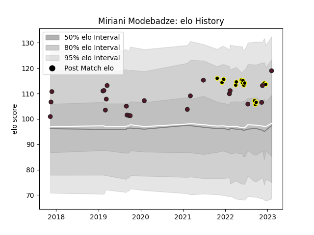

---  
layout: page  
title: Miriani Modebadze  
date: 2023-02-05 15:13:16.332631  
categories: player  
---
# Miriani Modebadze

## Positions: W, FB

## Country: Georgia

## Current elo: 119.0

## Current Percentile: 84.0

# Elo History

# Match History

| Team       |   Appearances |   Win Rate |
|:-----------|--------------:|-----------:|
| Georgia    |            22 |   0.704545 |
| Black Lion |            15 |   0.766667 |

| Opponent                 |   Matches |   Win Rate |
|:-------------------------|----------:|-----------:|
| Portugal                 |         3 |   0.833333 |
| Wales                    |         3 |   0.333333 |
| Tel-Aviv Heat            |         3 |   0.833333 |
| Romania                  |         2 |   1        |
| Scotland                 |         2 |   0        |
| Germany                  |         2 |   1        |
| Lokomotiv Penza          |         2 |   0.5      |
| Netherlands              |         2 |   1        |
| Russia                   |         2 |   1        |
| United States of America |         1 |   1        |
| Spain                    |         1 |   1        |
| Samoa                    |         1 |   0        |
| SWD Eagles               |         1 |   1        |
| Romanian Wolves          |         1 |   1        |
| Belgium                  |         1 |   1        |
| RC Batumi                |         1 |   1        |
| Boland Cavaliers         |         1 |   0        |
| Leopards                 |         1 |   1        |
| Griffons                 |         1 |   0        |
| Fiji                     |         1 |   0        |
| Eastern Province Kings   |         1 |   1        |
| Castilla y Leon Iberians |         1 |   1        |
| Canada                   |         1 |   1        |
| Border Bulldogs          |         1 |   1        |
| Zimbabwe Goshawks        |         1 |   1        |