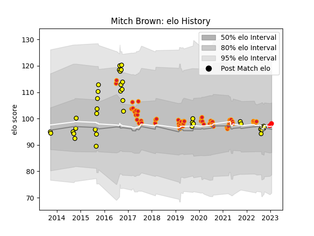

---  
layout: page  
title: Mitch Brown  
date: 2022-12-28 12:58:05.522678  
categories: player  
---
# Mitch Brown

## Positions: L, FL

## Current elo: 105.0

## Current Percentile: 78.0

# Elo History

# Match History

| Team                  |   Appearances |   Win Rate |
|:----------------------|--------------:|-----------:|
| Chiefs                |            59 |   0.550847 |
| Taranaki              |            39 |   0.628205 |
| Yokohama Canon Eagles |             1 |   0.5      |

| Opponent                          |   Matches |   Win Rate |
|:----------------------------------|----------:|-----------:|
| Crusaders                         |        11 |   0.272727 |
| Hurricanes                        |         9 |   0.5      |
| Highlanders                       |         7 |   0.357143 |
| Bay of Plenty                     |         6 |   0.666667 |
| Blues                             |         6 |   0.583333 |
| Wellington                        |         4 |   0.5      |
| Queensland Reds                   |         4 |   0.75     |
| Auckland                          |         3 |   0.666667 |
| Waikato                           |         3 |   0.5      |
| Tasman                            |         3 |   0.333333 |
| Sunwolves                         |         3 |   0.666667 |
| Southland                         |         3 |   1        |
| Northland                         |         3 |   0.666667 |
| Melbourne Rebels                  |         3 |   1        |
| Manawatu                          |         3 |   0.666667 |
| Counties Manukau                  |         3 |   1        |
| Canterbury                        |         3 |   0.666667 |
| Stormers                          |         2 |   0.5      |
| Moana Pasifika                    |         2 |   1        |
| New South Wales Waratahs          |         2 |   1        |
| Brumbies                          |         2 |   0        |
| Hawke's Bay                       |         2 |   0.5      |
| Otago                             |         2 |   0.5      |
| Bulls                             |         2 |   1        |
| British and Irish Lions           |         1 |   0        |
| Lions                             |         1 |   0        |
| Cheetahs                          |         1 |   1        |
| Sharks                            |         1 |   1        |
| Kubota Spears Funabashi Tokyo-Bay |         1 |   0.5      |
| North Harbour                     |         1 |   0        |
| Jaguares                          |         1 |   1        |
| Western Force                     |         1 |   1        |