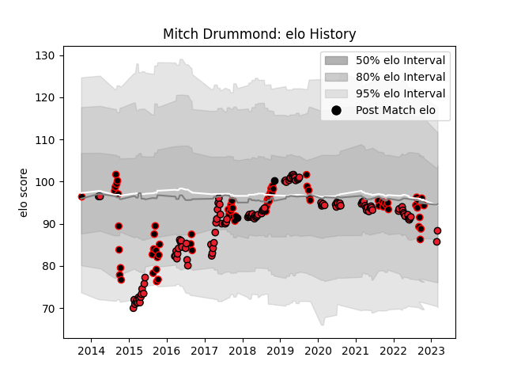

---  
layout: page  
title: Mitch Drummond  
date: 2023-03-29 11:30:59.156745  
categories: player  
---
# Mitch Drummond

Last updated: 2023-03-29
## Positions: SH

## Country: New Zealand

## Current elo: 94.0

## Current Percentile: 48.0

# Elo History

# Match History

| Team        |   Appearances |   Win Rate |
|:------------|--------------:|-----------:|
| Crusaders   |           124 |   0.806452 |
| Canterbury  |            73 |   0.767123 |
| New Zealand |             2 |   1        |

| Opponent                 |   Matches |   Win Rate |
|:-------------------------|----------:|-----------:|
| Highlanders              |        18 |   0.777778 |
| Hurricanes               |        18 |   0.666667 |
| Chiefs                   |        17 |   0.588235 |
| Blues                    |        15 |   0.933333 |
| Tasman                   |        10 |   0.7      |
| Auckland                 |         8 |   0.625    |
| Queensland Reds          |         8 |   1        |
| Lions                    |         7 |   0.857143 |
| Wellington               |         7 |   0.428571 |
| Melbourne Rebels         |         7 |   0.857143 |
| Taranaki                 |         6 |   0.5      |
| Otago                    |         6 |   1        |
| North Harbour            |         6 |   0.833333 |
| New South Wales Waratahs |         6 |   0.833333 |
| Manawatu                 |         6 |   0.833333 |
| Waikato                  |         5 |   0.8      |
| Northland                |         5 |   1        |
| Counties Manukau         |         5 |   1        |
| Sharks                   |         4 |   0.875    |
| Brumbies                 |         4 |   1        |
| Bulls                    |         4 |   0.75     |
| Southland                |         4 |   0.75     |
| Jaguares                 |         3 |   1        |
| Stormers                 |         3 |   0.833333 |
| Western Force            |         3 |   1        |
| Hawke's Bay              |         3 |   1        |
| Cheetahs                 |         2 |   1        |
| Sunwolves                |         2 |   1        |
| Bay of Plenty            |         2 |   1        |
| Southern Kings           |         1 |   1        |
| Fijian Drua              |         1 |   1        |
| France                   |         1 |   1        |
| British and Irish Lions  |         1 |   0        |
| Japan                    |         1 |   1        |