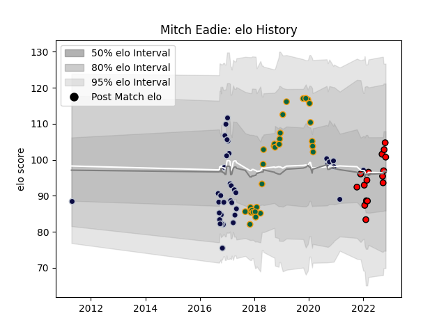

---  
layout: page  
title: Mitch Eadie  
date: 2022-12-14 11:12:41.123986  
categories: player  
---
# Mitch Eadie

## Positions: N8, FL

## Current elo: 97.0

## Current Percentile: 41.0

# Elo History

# Match History

| Team               |   Appearances |   Win Rate |
|:-------------------|--------------:|-----------:|
| Bristol Rugby      |            35 |   0.242857 |
| Northampton Saints |            30 |   0.366667 |
| Hartpury College   |            18 |   0.361111 |

| Opponent            |   Matches |   Win Rate |
|:--------------------|----------:|-----------:|
| Sale Sharks         |         7 |   0.285714 |
| Saracens            |         6 |   0.166667 |
| Worcester Warriors  |         5 |   0.6      |
| Exeter Chiefs       |         5 |   0        |
| Newcastle Falcons   |         5 |   0        |
| Bath Rugby          |         5 |   0.2      |
| Wasps               |         4 |   0        |
| Leicester Tigers    |         4 |   0.25     |
| Northampton Saints  |         3 |   0.333333 |
| London Irish        |         3 |   0.5      |
| Harlequins          |         3 |   0.333333 |
| Ampthill            |         3 |   0.666667 |
| Bristol Rugby       |         3 |   0.333333 |
| Coventry            |         3 |   0.666667 |
| Ealing Trailfinders |         2 |   0        |
| Gloucester Rugby    |         2 |   0        |
| Benetton Treviso    |         2 |   1        |
| Richmond            |         2 |   0        |
| Ospreys             |         2 |   0        |
| Jersey              |         2 |   0        |
| Doncaster           |         2 |   0        |
| Dragons             |         2 |   1        |
| Caldy               |         1 |   1        |
| Cardiff Blues       |         1 |   0        |
| London Scottish     |         1 |   0.5      |
| Pau                 |         1 |   1        |
| Clermont Auvergne   |         1 |   1        |
| Timisoara Saracens  |         1 |   1        |
| Bedford             |         1 |   0        |
| Nottingham          |         1 |   1        |