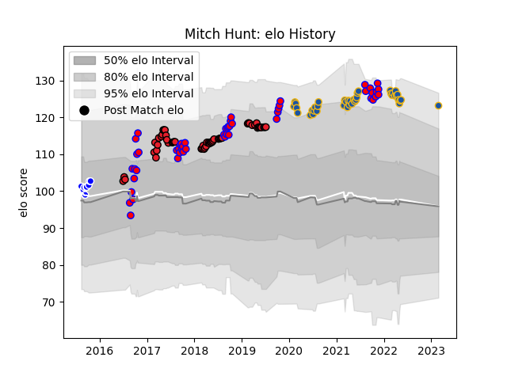

---  
layout: page  
title: Mitch Hunt  
date: 2023-03-21 18:04:17.259578  
categories: player  
---
# Mitch Hunt

Last updated: 2023-03-21
## Positions: FH, FB

## Country: Crusaders

## Current elo: 121.0

## Current Percentile: 91.0

# Elo History

# Match History

| Team        |   Appearances |   Win Rate |
|:------------|--------------:|-----------:|
| Crusaders   |            54 |   0.833333 |
| Tasman      |            50 |   0.71     |
| Highlanders |            43 |   0.395349 |
| Auckland    |            10 |   0.65     |

| Opponent                 |   Matches |   Win Rate |
|:-------------------------|----------:|-----------:|
| Hurricanes               |        14 |   0.428571 |
| Blues                    |        13 |   0.461538 |
| Chiefs                   |        12 |   0.583333 |
| Canterbury               |         9 |   0.111111 |
| Crusaders                |         8 |   0.125    |
| Highlanders              |         7 |   0.857143 |
| Hawke's Bay              |         6 |   0.666667 |
| Auckland                 |         6 |   0.833333 |
| Waikato                  |         6 |   0.5      |
| Melbourne Rebels         |         5 |   0.8      |
| Southland                |         5 |   0.9      |
| Taranaki                 |         5 |   0.8      |
| Brumbies                 |         5 |   0.8      |
| Queensland Reds          |         4 |   1        |
| Wellington               |         4 |   1        |
| Otago                    |         4 |   0.75     |
| New South Wales Waratahs |         4 |   0.75     |
| Western Force            |         4 |   1        |
| Lions                    |         4 |   1        |
| Bulls                    |         4 |   0.75     |
| North Harbour            |         3 |   0.833333 |
| Northland                |         3 |   1        |
| Sharks                   |         3 |   0.5      |
| Counties Manukau         |         3 |   1        |
| Stormers                 |         3 |   0.833333 |
| Manawatu                 |         3 |   0.666667 |
| Jaguares                 |         2 |   1        |
| Tasman                   |         2 |   1        |
| Bay of Plenty            |         1 |   1        |
| Moana Pasifika           |         1 |   1        |
| Fijian Drua              |         1 |   1        |
| Sunwolves                |         1 |   1        |
| Cheetahs                 |         1 |   1        |
| British and Irish Lions  |         1 |   0        |