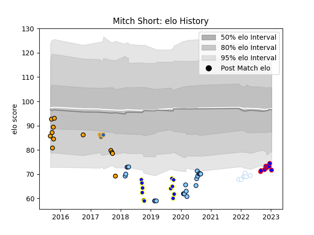

---  
layout: page  
title: Mitch Short  
date: 2022-11-22 11:31:53.684652  
categories: player  
---
# Mitch Short

## Positions: SH

## Current elo: 88.0

## Current Percentile: 19.0

# Elo History

# Match History

| Team                     |   Appearances |   Win Rate |
|:-------------------------|--------------:|-----------:|
| New South Wales Waratahs |            22 |   0.522727 |
| NSW Country Eagles       |            10 |   0.35     |
| Sydney Rays              |             9 |   0.111111 |
| Racing 92                |             7 |   0.571429 |
| Beziers                  |             6 |   0.333333 |
| Western Force            |             6 |   0.333333 |

| Opponent            |   Matches |   Win Rate |
|:--------------------|----------:|-----------:|
| Queensland Reds     |         4 |   0.75     |
| Brumbies            |         4 |   0.25     |
| Melbourne Rebels    |         4 |   0.5      |
| Queensland Country  |         4 |   0.25     |
| Canberra Vikings    |         3 |   0        |
| Western Force       |         3 |   0.666667 |
| Sunwolves           |         2 |   1        |
| Brisbane City       |         2 |   0.25     |
| Chiefs              |         2 |   0        |
| Sharks              |         2 |   0.25     |
| NSW Country Eagles  |         2 |   0        |
| Hurricanes          |         2 |   0        |
| Lions               |         2 |   0.5      |
| Melbourne Rising    |         2 |   0        |
| Stormers            |         1 |   1        |
| Sydney Stars        |         1 |   1        |
| Provence Rugby      |         1 |   0        |
| Perth Spirit        |         1 |   1        |
| Perpignan           |         1 |   0        |
| Pau                 |         1 |   1        |
| Vannes              |         1 |   0        |
| North Harbour Rays  |         1 |   1        |
| Aurillac            |         1 |   0        |
| Mont-de-Marsan      |         1 |   1        |
| Biarritz Olympique  |         1 |   1        |
| Lyon                |         1 |   0        |
| Jaguares            |         1 |   1        |
| Grenoble            |         1 |   0        |
| Greater Sydney Rams |         1 |   0        |
| Fijian Drua         |         1 |   0        |
| Crusaders           |         1 |   0        |
| Castres Olympique   |         1 |   0        |
| Brive               |         1 |   1        |
| Bordeaux Begles     |         1 |   1        |
| Blues               |         1 |   0        |
| Massy               |         1 |   1        |