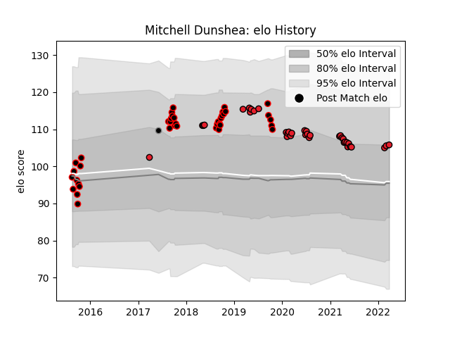

---  
layout: page  
title: Mitchell Dunshea  
date: 2023-02-24 09:54:09.591421  
categories: player  
---
# Mitchell Dunshea

## Positions: L

## Country: Provincial Union XV

## Current elo: 106.0

## Current Percentile: 74.0

# Elo History

# Match History

| Team                |   Appearances |   Win Rate |
|:--------------------|--------------:|-----------:|
| Canterbury          |            39 |   0.794872 |
| Crusaders           |            36 |   0.847222 |
| Provincial Union XV |             1 |   0        |

| Opponent                 |   Matches |   Win Rate |
|:-------------------------|----------:|-----------:|
| Chiefs                   |         9 |   0.666667 |
| Auckland                 |         5 |   0.6      |
| Blues                    |         5 |   1        |
| North Harbour            |         5 |   1        |
| Tasman                   |         4 |   0.75     |
| Hurricanes               |         4 |   0.75     |
| Taranaki                 |         4 |   0.5      |
| Otago                    |         4 |   1        |
| Wellington               |         3 |   0.333333 |
| Counties Manukau         |         3 |   1        |
| Hawke's Bay              |         3 |   1        |
| Highlanders              |         3 |   0.666667 |
| New South Wales Waratahs |         2 |   1        |
| Waikato                  |         2 |   1        |
| Southland                |         2 |   1        |
| Queensland Reds          |         2 |   1        |
| Melbourne Rebels         |         2 |   1        |
| Manawatu                 |         2 |   0.5      |
| Western Force            |         2 |   1        |
| Moana Pasifika           |         1 |   1        |
| Northland                |         1 |   1        |
| Bay of Plenty            |         1 |   1        |
| Sharks                   |         1 |   0.5      |
| Lions                    |         1 |   1        |
| Sunwolves                |         1 |   1        |
| Jaguares                 |         1 |   1        |
| Bulls                    |         1 |   1        |
| Brumbies                 |         1 |   1        |
| British and Irish Lions  |         1 |   0        |