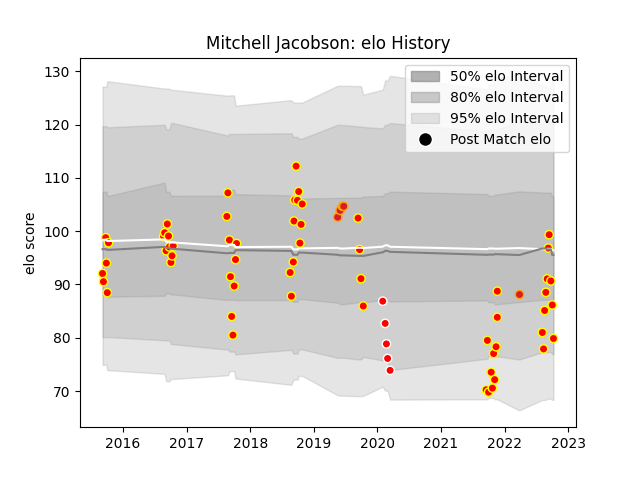

---  
layout: page  
title: Mitchell Jacobson  
date: 2023-02-24 02:33:49.244314  
categories: player  
---
# Mitchell Jacobson

## Positions: FL

## Current elo: 80.0

## Current Percentile: 22.0

# Elo History

# Match History

| Team      |   Appearances |   Win Rate |
|:----------|--------------:|-----------:|
| Waikato   |            59 |   0.508475 |
| Chiefs    |             5 |   0.4      |
| Sunwolves |             5 |   0.2      |

| Opponent         |   Matches |   Win Rate |
|:-----------------|----------:|-----------:|
| Wellington       |         6 |   0.333333 |
| Hawke's Bay      |         6 |   0.583333 |
| Tasman           |         6 |   0.5      |
| Northland        |         6 |   0.5      |
| Taranaki         |         5 |   0.5      |
| Bay of Plenty    |         5 |   0.6      |
| Otago            |         4 |   0.5      |
| Manawatu         |         4 |   0.5      |
| Counties Manukau |         4 |   0.5      |
| Canterbury       |         4 |   0.25     |
| Crusaders        |         3 |   0.333333 |
| North Harbour    |         3 |   0.333333 |
| Southland        |         3 |   1        |
| Auckland         |         3 |   0.666667 |
| Melbourne Rebels |         2 |   1        |
| Hurricanes       |         1 |   0        |
| Jaguares         |         1 |   0        |
| Chiefs           |         1 |   0        |
| Queensland Reds  |         1 |   0        |
| Blues            |         1 |   0        |