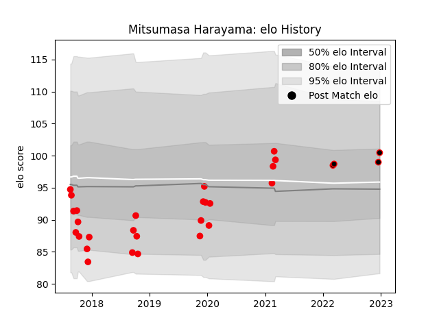

---  
layout: page  
title: Mitsumasa Harayama  
date: 2023-03-21 18:28:32.693488  
categories: player  
---
# Mitsumasa Harayama

Last updated: 2023-03-21
## Positions: H

## Current elo: 105.0

## Current Percentile: 70.0

# Elo History

# Match History

| Team                            |   Appearances |   Win Rate |
|:--------------------------------|--------------:|-----------:|
| Coca-Cola Red Sparks            |            34 |   0.308824 |
| NTT Docomo Red Hurricanes Osaka |             9 |   0.666667 |

| Opponent                          |   Matches |   Win Rate |
|:----------------------------------|----------:|-----------:|
| Toyota Industries Shuttles Aichi  |         4 |       0.25 |
| Skyactivs Hiroshima               |         4 |       1    |
| Yokohama Canon Eagles             |         3 |       0    |
| Chugoku Red Regulions             |         3 |       1    |
| Hanazono Kintetsu Liners          |         3 |       0    |
| Kyuden Voltex                     |         3 |       1    |
| Toshiba Brave Lupus Tokyo         |         2 |       0    |
| Shimizu Blue Sharks               |         2 |       1    |
| Saitama Wild Knights              |         2 |       0    |
| Black Rams Tokyo                  |         2 |       0    |
| Kurita Water Gush                 |         2 |       0.5  |
| Kubota Spears Funabashi Tokyo-Bay |         2 |       0    |
| Munakata Sanix Blues              |         2 |       0    |
| Mitsubishi Dynaboars              |         1 |       0    |
| Mie Honda Heat                    |         1 |       0    |
| NTT Docomo Red Hurricanes Osaka   |         1 |       1    |
| Mazda Blue Zoomers                |         1 |       1    |
| Shizuoka Blue Revs                |         1 |       0    |
| Kamaishi Seawaves                 |         1 |       0.5  |
| Green Rockets Tokatsu             |         1 |       0    |
| Toyota Verblitz                   |         1 |       0    |
| Urayasu D-Rocks                   |         1 |       0    |