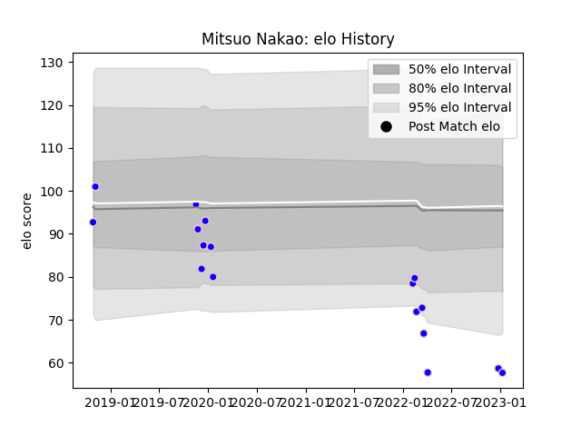

---  
layout: page  
title: Mitsuo Nakao  
date: 2022-12-28 12:54:25.069090  
categories: player  
---
# Mitsuo Nakao

## Positions: L

## Current elo: 81.0

## Current Percentile: 9.0

# Elo History

# Match History

| Team              |   Appearances |   Win Rate |
|:------------------|--------------:|-----------:|
| Kurita Water Gush |            16 |     0.3125 |

| Opponent                         |   Matches |   Win Rate |
|:---------------------------------|----------:|-----------:|
| Chugoku Red Regulions            |         2 |        0.5 |
| Kamaishi Seawaves                |         2 |        0.5 |
| Kyuden Voltex                    |         2 |        0.5 |
| Munakata Sanix Blues             |         2 |        0   |
| Shimizu Blue Sharks              |         2 |        0.5 |
| Toyota Industries Shuttles Aichi |         2 |        0   |
| Coca-Cola Red Sparks             |         1 |        0   |
| Hanazono Kintetsu Liners         |         1 |        0   |
| Mazda Blue Zoomers               |         1 |        1   |
| Mitsubishi Dynaboars             |         1 |        0   |