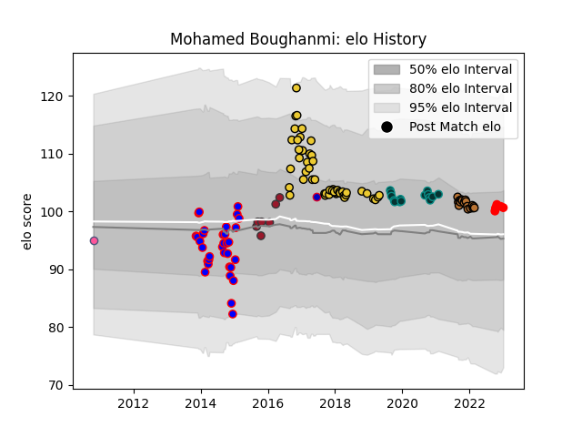

---  
layout: page  
title: Mohamed Boughanmi  
date: 2022-12-18 16:31:19.913075  
categories: player  
---
# Mohamed Boughanmi

## Positions: P

## Country: France

## Current elo: 93.0

## Current Percentile: 39.0

# Elo History

# Match History

| Team                 |   Appearances |   Win Rate |
|:---------------------|--------------:|-----------:|
| La Rochelle          |            50 |   0.58     |
| Pau                  |            14 |   0.392857 |
| Beziers              |            12 |   0.5      |
| Narbonne             |             7 |   0        |
| Toulon               |             7 |   0.714286 |
| Rouen                |             6 |   0.5      |
| France               |             1 |   0        |
| Stade Francais Paris |             1 |   1        |

| Opponent             |   Matches |   Win Rate |
|:---------------------|----------:|-----------:|
| Lyon                 |         6 |   0.416667 |
| Montpellier Herault  |         6 |   0.5      |
| Brive                |         5 |   0.4      |
| Castres Olympique    |         5 |   0.6      |
| Clermont Auvergne    |         4 |   0.375    |
| Stade Toulousain     |         4 |   0.75     |
| Stade Francais Paris |         4 |   0.5      |
| Gloucester Rugby     |         3 |   0.333333 |
| Oyonnax              |         3 |   0.666667 |
| Agen                 |         3 |   0.666667 |
| Bordeaux Begles      |         3 |   0.333333 |
| Racing 92            |         3 |   0.5      |
| Bayonne              |         3 |   0.666667 |
| Toulon               |         3 |   0        |
| Pau                  |         3 |   1        |
| Albi                 |         2 |   1        |
| Perpignan            |         2 |   0.5      |
| Montauban            |         2 |   0        |
| Mont-de-Marsan       |         2 |   0.5      |
| Massy                |         2 |   0.5      |
| Wasps                |         2 |   0.5      |
| La Rochelle          |         2 |   0.5      |
| Aurillac             |         2 |   0        |
| Cardiff Blues        |         2 |   0.5      |
| Carcassonne          |         2 |   0.5      |
| Harlequins           |         1 |   1        |
| Rouen                |         1 |   0        |
| Ulster               |         1 |   0        |
| Bath Rugby           |         1 |   1        |
| Benetton Treviso     |         1 |   1        |
| Beziers              |         1 |   0        |
| Soyaux-Angouleme     |         1 |   1        |
| South Africa         |         1 |   0        |
| Scarlets             |         1 |   0        |
| RC Enisei            |         1 |   1        |
| Biarritz Olympique   |         1 |   1        |
| Grenoble             |         1 |   1        |
| Provence Rugby       |         1 |   0        |
| Bourgoin-Jallieu     |         1 |   0        |
| Bristol Rugby        |         1 |   0        |
| Nevers               |         1 |   0        |
| Colomiers            |         1 |   1        |
| Dax                  |         1 |   1        |
| Edinburgh            |         1 |   1        |
| Yorkshire Carnegie   |         1 |   1        |