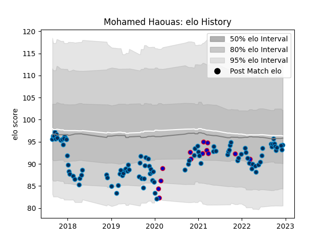

---  
layout: page  
title: Mohamed Haouas  
date: 2023-01-06 00:15:34.480194  
categories: player  
---
# Mohamed Haouas

## Positions: P

## Country: France

## Current elo: 103.0

## Current Percentile: 53.0

# Elo History

# Match History

| Team                |   Appearances |   Win Rate |
|:--------------------|--------------:|-----------:|
| Montpellier Herault |           102 |   0.544118 |
| France              |            14 |   0.785714 |

| Opponent             |   Matches |   Win Rate |
|:---------------------|----------:|-----------:|
| La Rochelle          |         8 |   0.625    |
| Bordeaux Begles      |         8 |   0.4375   |
| Lyon                 |         8 |   0.25     |
| Toulon               |         7 |   0.571429 |
| Stade Toulousain     |         7 |   0.285714 |
| Brive                |         7 |   0.642857 |
| Castres Olympique    |         7 |   0.571429 |
| Clermont Auvergne    |         7 |   0.428571 |
| Pau                  |         7 |   0.714286 |
| Agen                 |         6 |   0.666667 |
| Racing 92            |         6 |   0.166667 |
| Stade Francais Paris |         4 |   0.625    |
| Perpignan            |         4 |   0.75     |
| Wales                |         4 |   1        |
| England              |         3 |   0.666667 |
| Bayonne              |         3 |   0.666667 |
| Italy                |         2 |   1        |
| Oyonnax              |         2 |   1        |
| Glasgow Warriors     |         2 |   1        |
| Scotland             |         2 |   0        |
| Connacht             |         2 |   0.5      |
| Biarritz Olympique   |         2 |   1        |
| Ireland              |         2 |   1        |
| Argentina            |         1 |   1        |
| Grenoble             |         1 |   1        |
| Leinster             |         1 |   0        |
| London Irish         |         1 |   1        |
| Gloucester Rugby     |         1 |   1        |
| Exeter Chiefs        |         1 |   0        |